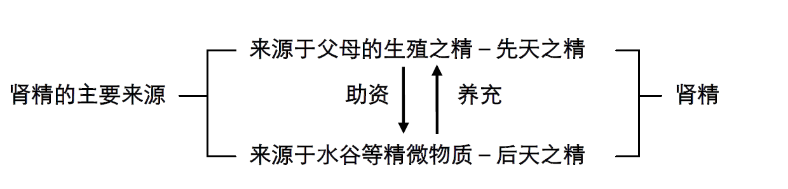
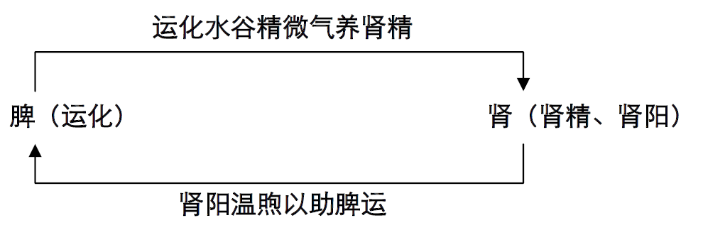
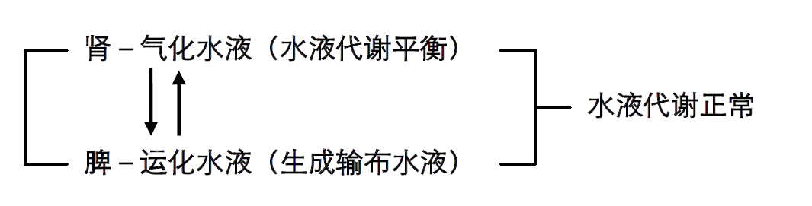
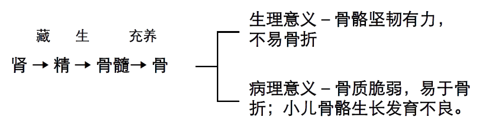

<!DOCTYPE  html PUBLIC "-//W3C//DTD XHTML 1.0 Transitional//EN" "http://www.w3.org/TR/xhtml1/DTD/xhtml1-transitional.dtd">
<html xmlns="http://www.w3.org/1999/xhtml"><head><meta http-equiv="Content-Type" content="text/html; charset=utf-8"/><title>节欲主义</title><meta name="author" content="Eric Yang"/></head><body>

 

节欲主义

 
<h1 style="text-indent: 0pt;line-height: 27pt;text-align: center;">丁福保编纂</h1><h1 style="padding-top: 2pt;padding-left: 20pt;text-indent: 159pt;text-align: left;">守拙汇编</h1>
 

印光大师云：茫茫世界，芸芸人民，

 

十有八九，由色欲死，可不哀哉！ 如果您不想——多病早夭、未老先衰、死气阴沉。 如果您想要——解脱爱欲，长寿福乐，少病少恼，

家庭安和，子孙贤孝，社会清净。 此书有——非读、非行持、非劝说、非流通，不可阻遏之势。

 

1
<h3 style="padding-left: 0pt;text-indent: 0pt;line-height: 22pt;text-align: left;">郑重呼吁：此是—正本清源，根本之道。</h3>
 

 
<h3 style="padding-left: 65pt;text-indent: 0pt;line-height: 23pt;text-align: left;">欲者            谷深可容物，故贪得而不易满足为欲。</h3><h3 style="padding-top: 9pt;padding-left: 65pt;text-indent: 0pt;line-height: 132%;text-align: left;">欲者            以心有所贪欲，故欲是情之所好。 欲                是期望、想要、爱好，</h3><h3 style="padding-top: 2pt;padding-left: 65pt;text-indent: 0pt;text-align: left;">故佛说        欲为诸法本。</h3>
造作一切善业，欲是推动力； 而成就一切恶业，欲—更是少不了。
<h3 style="padding-left: 65pt;text-indent: 0pt;line-height: 27pt;text-align: left;">所以说        善用其心，存心制行耳。</h3><h3 style="padding-top: 9pt;padding-left: 65pt;text-indent: 0pt;line-height: 132%;text-align: left;">礼记说        欲不可从。 易经云        君子以惩忿窒欲。</h3><h3 style="padding-top: 2pt;padding-left: 65pt;text-indent: 0pt;line-height: 132%;text-align: left;">佛典更说    众生所有苦，皆以欲为本。 此等苦口,虽不中听，却有大受用。 恳劝            留得青山在，非为柴烧；</h3><h3 style="padding-top: 2pt;padding-left: 65pt;text-indent: 0pt;line-height: 132%;text-align: left;">敦请            爱惜精神,留他日担当宇宙。 切莫            磋跎岁月,尽此身污秽乾坤。</h3><h2 style="padding-left: 5pt;text-indent: 0pt;line-height: 24pt;text-align: left;">目录</h2>
<a href="#bookmark0" class="s4">编序                                                </a><a href="#bookmark0" class="s5">4</a>

<a href="#bookmark1" class="s4">第一节 总论                                        </a><a href="#bookmark1" class="s5">5</a>

<a href="#bookmark2" class="s4">第二节 未婚时之节欲                                </a><a href="#bookmark2" class="s5">6</a>

<a href="#bookmark3" class="a">实例三则                                                                                                                 </a><a href="#bookmark3" class="s6">12</a>

<a href="#bookmark4" class="a">手淫之治法：                                                                                                         </a><a href="#bookmark4" class="s6">14</a>

<a href="#bookmark5" class="s4">第三节 既婚后之节欲                               </a><a href="#bookmark5" class="s5">15</a>

<a href="#bookmark6" class="s4">第四节 杂论                                       </a><a href="#bookmark6" class="s5">18</a>

<a href="#bookmark7" class="s4">附录一、节录《印光大师文钞》                       </a><a href="#bookmark7" class="s5">20</a>

<a href="#bookmark7" class="a">（一）过患                                                                                                             </a><a href="#bookmark7" class="s6">20</a>

<a href="#bookmark8" class="a">（二）教示                                                                                                             </a><a href="#bookmark8" class="s6">21</a>

<a href="#bookmark8" class="a">（三）对治                                                                                                             </a><a href="#bookmark8" class="s6">21</a>

<a href="#bookmark9" class="a">（四）殷鉴                                                                                                             </a><a href="#bookmark9" class="s6">22</a>

<a href="#bookmark10" class="s4">附录二、《青年修养录》                             </a><a href="#bookmark10" class="s5">25</a>

<a href="#bookmark10" class="a">（一）卫生                                                                                                             </a><a href="#bookmark10" class="s6">25</a>

<a href="#bookmark11" class="a">（二）节欲                                                                                                             </a><a href="#bookmark11" class="s6">26</a>

<a href="#bookmark12" class="s4">附录三、由中医五行理论概谈淫欲之利害               </a><a href="#bookmark12" class="s5">31</a>

<a href="#bookmark12" class="a">（一）前提                                                                                                             </a><a href="#bookmark12" class="s6">31</a>

<a href="#bookmark13" class="a">（二）肾的生理功能                                                                                             </a><a href="#bookmark13" class="s6">32</a>

<a href="#bookmark15" class="s6">1、肾的生理功能                                                33</a>

<a href="#bookmark15" class="s6">2、肾精的主要来源                                              33</a>

<a href="#bookmark17" class="s6">3、肾精的主要作用                                              34</a>

<a href="#bookmark28" class="s6">4、肾与身体其它器官的关系                                      36</a>
<h2 style="padding-left: 5pt;text-indent: 0pt;line-height: 24pt;text-align: left;"><a name="bookmark0">编序</a></h2>
老子说:人之所以有大患，正因有这个身体。而此身最大的过患， 莫过于——淫欲一关。宋朝佛门高僧灵芝大师说：「节情禁欲，举世 所难；纵意为非，人之所欲」。故现今人人怕死而欲养生，却不知至 为伤生之事时时犯之，实为可叹！是父母不诫？老师不教？医生不 说？社会不匡？怪上述这些人吗？实无从怪起——因父母、老师等父 母亦未教；而医生少学无知，尚以“手淫泄精为正常生理行为”而宣 导之，据笔者所接触之青年学子，乃至已为人父者，皆直接、间接受 害于此杀人不见血之邪言恶论；而社会教育不彰，致使现代一切男 女，不论老少，受色情媒体之害，而皆近沦为人兽不分之地步，实令 人扼腕叹息！

 

古人云：「无病之身，不知其乐也；病生始知无病之乐」。（是 知菩萨畏因，众生畏果。）又云：「病者，所由适于死之路也；欲 者，所由适于病之路也；近声色者，所由适于欲之路也。塞此三路， 惟在节欲」。古来有识之贤士或发于言论，或者于医书，咸以此为 要。怎奈今大小医院林立，且健保局负担沉重呢？又于经济最萧条之 际，失业人口骤增，致许多家庭破碎，学童缴不起学费、营养午餐 费，连慈善机构也收不到足够的善款……；反而据报导统计，每年有 数亿之台币；国人消费于国外前来淘金及国内之妓女等花柳场所中， 此乃讽刺至极之事实。更甚者，莫过于由淫欲而造杀业—堕胎（可参 见《敬悼已被残蚀的理性》一书，每年有四、五十万条生命被堕 杀）。须知，世出、世间的因果，报应至惨者，莫过杀业，而损福德 最快的，莫过邪淫。纵欲无度，已伤身至重，（即福德日消之显相， 至于隐微之祸果，待福报一尽，乃至临终即可见之。切不要以其害未 降于我身，便以为是妄说。）偏又以“堕胎就是避孕”的无知概念来 淹没自己的良知。由一身、一家乃至社会国家，即可由微观进而全观 了知目下人心惶惶不安（据知忧郁、躁郁等精神官能症，是下一世纪之三大疾病杀手之二：而不要忘了—爱滋病现仍是不治之症）、治安乱相（财色—两为自、他杀之根本）天灾人祸频仍等之端倪。

 

今有前贤丁福保居士（1874－1952，江苏无锡人，字仲祐，号畴 隐居士。幼通经史，长而中西兼贯，长于算术、医学、词章等，通日 文。卅六岁赴日考察医学，后于上海行医并创办医学书局。年逾四十 始向佛），编纂《节欲主义》一书，详明婚前、婚后，手淫及男女、 夫妇纵欲之祸患；前有台中莲社另节录《印光大师文钞》增补印行， 今重新打字排版，标以新式标点，并更多增警文，以期人各悉知忌 讳，不致于因无知而罹废疾，乃至误断宝贵性命。 印光大师云：

「茫茫世界，芸芸人民，十有八九，由色欲死，可不哀哉」！此重新 整理编印流通之本怀也。

敬祈人各爱己身、世之爱儿女者，及深愍“人饥己饥，人溺己 溺”为同胞作幸福防祸患者，能舍无情之钱财，行仁慈之义举，有钱 出钱，有力出力，发心印送，展转流通，（诸如《寿康宝鉴》、《保 命延寿法》、《敬悼已被残蚀的理性》等诸诫劝善书，皆应如是广为 流通）。俾人人身心清宁，社会祥和安康，是所至祷。

 

岁次癸未九十二年十二月廿四日守拙敬序于恒畜德斋
<h2 style="padding-top: 12pt;padding-left: 5pt;text-indent: 0pt;text-align: left;">第一节    总论</h2>
 

人之斫丧，非止一端，即如耳听、目视、劳神、费力、忧愁、忿 怒、思虑、言语过多、饮食男女，皆为斫丧之事，故皆宜有节；然其 最要者莫如节欲。彭篯曰：「上士别床，中士异被。服药百里，不如独卧」。列仙传引广成子曰：「无劳汝形，无摇汝精，乃可以长 生」。庄子在宥引董子曰：「新壮者十日一游于房，中年倍新壮，始 衰者倍中年，中衰者倍始衰。大衰者之月，当新壮之日」。春秋繁露 循天之道程明道先生曰：「吾受气甚薄，三十而浸盛，四十五十而后 完。今生七十二年矣，较具筋骨于盛年无损也」。门人曰：「先生岂以受气之薄，而厚为保生耶」？先生曰：「</a>吾以忘生徇欲为深耻」。

程伊川先生曰：「阳始生甚微，安静而后能长。故复之象曰：先王以 至日闭关。此皆吾国古来节欲精微之论也。由节欲而进于无欲。则超凡入圣矣」。王龙溪先生曰：「圣学之要，以无欲为主，以寡欲为 功。寡之又寡以至于无，无为而无不为，寂而非静，感而非动，无寂无感，无动无静，明通公薄，而圣可几矣」。此实际也，故二林居士 彭尺木先生年三十四即断欲、不复近妇人，乃作偈曰：「从妄有爱， 万死万生；猛然斫断，天地清宁」。学者由节欲而至断欲，则庶乎其入道矣。

<h2 style="padding-top: 12pt;padding-left: 5pt;text-indent: 0pt;text-align: justify;">第二节    未婚时之节欲</h2>
 

男子未结婚以前，在情欲感动时，往往不能遏制。以手泄精，遂 成手淫之恶习，若视察其衣衾上有黄色之斑点，此即手淫之据。犯之 者其害有十，列举如下：
<h3 style="padding-top: 9pt;padding-left: 29pt;text-indent: 0pt;line-height: 132%;text-align: left;">一、身体长不足。
</h3><h3 style="padding-top: 7pt;padding-left: 59pt;text-indent: -30pt;line-height: 23pt;text-align: left;"> 二、脑髓亏乏，聪明减少，时发健忘等症。 </h3><h3 style="padding-top: 7pt;padding-left: 59pt;text-indent: -30pt;line-height: 23pt;text-align: left;">三、耳鸣头眩，目光变短。 </h3><h3 style="padding-top: 7pt;padding-left: 59pt;text-indent: -30pt;line-height: 23pt;text-align: left;">四、面白而瘦，口吐白痰。 </h3><h3 style="padding-top: 7pt;padding-left: 59pt;text-indent: -30pt;line-height: 23pt;text-align: left;">五、时有淫梦。日间见女人，即有漏精之患。</h3><h3 style="padding-top: 7pt;padding-left: 59pt;text-indent: -30pt;line-height: 23pt;text-align: left;">六、精泄时或有爱惜之意，不使泄出，致精虫死腐，酿成睾丸 病。</h3><h3 style="padding-top: 8pt;padding-left: 29pt;text-indent: 0pt;line-height: 132%;text-align: left;">七、身体孱弱，易染风寒瘟疫肺痨等症，以致夭折。 </h3><h3 style="padding-top: 7pt;padding-left: 59pt;text-indent: -30pt;line-height: 23pt;text-align: left;">八、胃力减少，行步蹒跚。</h3><h3 style="padding-left: 29pt;text-indent: 0pt;line-height: 22pt;text-align: left;">九、生殖器易损伤。</h3><h3 style="padding-left: 29pt;text-indent: 0pt;line-height: 37pt;text-align: left;">十、斫丧过甚，精虫弱小，异日所生子女。不克强壮。 此外又常有一种含羞之状，多梦、烦扰、眼痛、疲倦、血亏、大小腿肌肉无力、手易发抖，其中最显明之病状，即上述之健忘是也。 手淫日久者，则成下列诸病：</h3><h3 style="padding-top: 12pt;padding-left: 5pt;text-indent: 24pt;line-height: 120%;text-align: left;">癫（即疯子）Insanity、目盲 Blindness、食不消化 Indi gestion、悒又名抑郁病（疯病之一种）Melancholia、忧郁病（疯病 之一种）Hypochondriasis、斜眼 Squint、不能睡眠（脑神经衰弱） Sleeplessness、头痛、心跳、干咳（此种干咳最易误认为肺劳 病）。手脚酸痛、阳痿不举。</h3>
 

《少年进德录》中，论手淫之害最为详尽，兹不嫌其辞之复，再 录于下，亦怵目惊心之一助也。

其言曰：手淫之害，较大于交接，犯此恶习者，多在少年，往往 旦旦伐之，以短促其生命。其发现之病状，为脑神经衰弱、记忆力缺 乏，作事易倦，屡呼头痛，动辄忿怒悲泣。阴茎软弱无力，精液中无 精虫；或全失交接之力，而成为阴萎症。梦中漏泄精液，或时有精液 之漏泄，而成滑精症。四肢乏力，躯体踉跄，不良于行，立足不稳， 不能支持其躯体。手指震颤，眼中无光，视力衰减，眼窝陷没，耳鸣 重听。头重，时发眩晕。面如土色，皮肤苍白，全呈病态。筋肉弛缓 无力，睡眠终夜不安，心跳惊悸，腰部酸痛。身体及精神，均起障 害，终日昏懵，如在五里雾中。思考力渐渐减退，而归于消减。关节 疼痛，消化力障碍，胃腑痉挛。血液衰减，胸部充塞，皮肤肿溃。全 身枯搞赢惫，神气黯然，如蜡人院之偶像，毫无生气。或成痴愚，或 成肺痨癫癫，或致自杀，或卒倒夭死，或幸免早殇，而长为病夫以终 身焉。夫无论何事，皆可防患于未然，独至手淫之恶习，暗室亏心， 负惭衾影，为父兄不及知，为师长不及觉，欲防之而不胜其防，故其 为害，有如是之剧烈也。

手淫之迟早，随地之冷热而异，随人之体质而别，不能一定。据 富挨拉其氏之说，发情期如早四年，则寿命必缩短二十年；不但缩短 寿命，而于身体之发育，亦大有碍也。近岁以来，学生发情期甚早，往往至十三四岁，竟有犯手淫者，不如令其早明利害，使有所警惕， 而斯弊或少熄焉。

 

美国有一童子，年十二，多病，父母忧之甚，乞数医调治，无寸 效。气体日弱，渐至危险。有一医欲究其病原，避其父母，用缓词询 其手淫，童子始则愧缩，不以实告，再三穷诘，乃言曰：「余七八岁 时，一日登树取柿，树干适与阴茎相触，稍觉快美，即恋恋不能舍。 日登树摩擦之，遂有少许之白液泄出。后渐渐以手代树，日以为常。 至十岁左右，虽身体孱弱，尚不能自禁，遂有今日之状态」。医以此 语告其父母，皆甚惊异，颇悔从前之不注意也。乞该医种种调治，病 卒不起。

 

英国伦敦有商家子，年十五，未习商业，颜色青白，精神疲乏终 日郁郁。其父母忧之，延名医诊视，曰：「令郎无别症，特感动春情，多犯手淫耳」。因令服药外，每朝以冷水洗腰部及阴茎，使阳稍 萎；至六礼拜后，病遂愈。吾国犯手淫而夭折者甚多，惜乎未知此治 法也。（冷水之法最妥最效，盍试之）。

医学博士吴尔士曰：「生殖器之内部，更有精囊，乃二小袋，囊 俱为球形小腺，时时分泌一种胶性之蛋白质，以作精虫之养料；此蛋 白质，非如元液之为养生原质，常贮于精囊之中，待其饱涨，则天然 自能使之宣泄于体外；此宣泄之事，恒于夜眠之间为之，故曰梦 遗」。凡十六七岁之少年男子（亦有不及此年龄者）即起始有梦遗， 少年当知此为天然合理之事，不伤精神，无庸怀忧，反足消释色情之 冲动。因精囊膨涨，即起有激刺也。初则二三月中梦遗一次，其后则 渐近，至每三四周一次，其后或可每周或旬日一次。如每次遗泄之后，精神并无困乏之状，则可不必介意。精囊所贮之液，其满有定 期。当其满时，即刺激脑系，而使色情旺盛。此少年男子色情之盛衰，所以有定期也。大约每二周至四周，则精囊所贮已足，当时欲念最盛，最易犯手淫之试诱。故少年必于此时努力克制，制其思念，如 驭怒马，不使奔逸。且多致意于正业及运动，迨数日之后，经天然之 梦遗，而色情骤减，则于其后之二周至四周间，可觉色情之平淡矣。 或谓：「手淫梦遗，同为泄精液于体外，其中有何分别，而一则为害 甚大，一则无妨元神」？答曰：「其中固有不同，梦遗所泄者，纯为 精囊所贮之蛋白质，及数个精虫耳；若夫手淫所泄者，则此蛋白质之 外，有数百万新鲜精虫，由睾丸而出，且有宝贵之元液若干，与之同 泄，故二者实有天渊之别。凡我少年，不可不知」。</h3>
 

手淫之害，既如上述，然其原因甚多，尤不可不随时注意者，兹 撮略如下：

 
<h3 style="padding-left: 59pt;text-indent: -30pt;line-height: 23pt;text-align: left;">一、原因于乳母常与儿童接吻，或玩弄其阴部，幼时已受一种感 觉，及长则陷于手淫之弊。</h3><h3 style="padding-top: 13pt;padding-left: 59pt;text-indent: -30pt;line-height: 23pt;text-align: left;">二、原因于儿童攀树木，登高山，衣服摩擦其阴部，有一种感 觉，不知不识之间，流为恶癖。</h3><h3 style="padding-top: 2pt;padding-left: 29pt;text-indent: 0pt;line-height: 37pt;text-align: left;">三、原因于儿童伏身而卧，阴部接触床褥。 </h3><h3 style="padding-top: 2pt;padding-left: 29pt;text-indent: 0pt;line-height: 37pt;text-align: left;">四、原因于直肠生蛲虫，刺激阴部，或阴部不洁，有粘稠物蓄积发痒。于是以手搔之、摩擦之。</h3><h3 style="padding-top: 9pt;padding-left: 29pt;text-indent: 0pt;line-height: 132%;text-align: left;">五、原因于乘骡马摩擦。 </h3><h3 style="padding-top: 2pt;padding-left: 29pt;text-indent: 0pt;line-height: 37pt;text-align: left;">六、原因于独居，无父母监督。 </h3><h3 style="padding-top: 2pt;padding-left: 29pt;text-indent: 0pt;line-height: 37pt;text-align: left;">七、原因于大便不通利，肛门作痒。</h3><h3 style="padding-top: 2pt;padding-left: 29pt;text-indent: 0pt;line-height: 37pt;text-align: left;"> 八、衣服被褥过于温暖，刺激阴部。</h3><h3 style="padding-top: 2pt;padding-left: 29pt;text-indent: 0pt;line-height: 37pt;text-align: left;"> 九、身体早熟及虚弱。</h3><h3 style="padding-left: 29pt;text-indent: 0pt;line-height: 22pt;text-align: left;">十、饮食物剌激性。</h3><h3 style="padding-top: 9pt;padding-left: 29pt;text-indent: 0pt;line-height: 132%;text-align: left;">十一、神经衰弱症。 </h3><h3 style="padding-top: 2pt;padding-left: 29pt;text-indent: 0pt;line-height: 37pt;text-align: left;">十二、不眠有妄想。 </h3><h3 style="padding-top: 2pt;padding-left: 29pt;text-indent: 0pt;line-height: 37pt;text-align: left;">十三、家庭不良，无善良之训导者。</h3>
此外尚有种种之诱因，足以促性欲之发动，而遂诱起手淫之恶癖 者，兹复略述于下：
<h3 style="padding-top: 13pt;padding-left: 5pt;text-indent: 24pt;line-height:120%;text-align: left;">青年时期，性欲处置，最为困难，为父兄者，须郑重之为说明， 晓以利害，不可过于秘密。青年之性欲兴奋者，尤易犯手淫，宜防其 为友朋诱惑。误入歧途。若身体不甚坚强者，切忌饮酒（佛教五戒中 有“不饮酒”一戒），酒之为物，能引起性欲，故青年宜远避之。</h3><h3 style="padding-top: 13pt;padding-left: 5pt;text-indent: 23pt;line-height: 120%;text-align: left;">人欲中以性欲为最难制，固矣。然此亦志行薄弱之人为然；若克 己自制之心强者，则不难制之。盖性欲发动之原因，男子为睾丸充满 精液，反射剌激脑中枢，女子为卵巢中有一种反射的刺激而起；其状 正如饥之思食，渴之思饮，所谓食色，性也。此外则卑猥之小说、谈 话、淫画、淫曲、淫戏，以及阴部剌激，男女肉体一部接触（例如握 手接吻），为性欲发动之诱因。</h3><h3 style="padding-top: 14pt;padding-left: 5pt;text-indent: 23pt;line-height: 120%;text-align: left;">制欲之正本清源法，如男则摘去睾丸，女则摘去卵巢，既不可 行，惟有去其诱因；若诱因已去，而犹性欲发功，难于自制，则行冷 水浴以强身，屋外散步以陶情，每日朗诵古昔圣贤之传记，或佛经， 圣经及戒淫文一二遍，收束身心，同时练习体操，及他种有益运动， 确有良效。</h3>
 

左列数条，亦抑制性欲所必要者，青年子弟，不可不参考之： 甲、力戒与年轻妇女接近及交谈——

（1）旅馆舟车之中，遇有年少妇女，须远而避之。四十以上之妇人，不在此例。

 

（2）有议论妇女之容貌装饰者，亦远而避之。

（3）罕至男女混杂之地。（案：尤以风月场所为甚）

（4）不得已而与年轻女子接谈，切不可有轻佻举动。 乙、常守规则的生活——

（1）每日大便，便秘易诱起色欲，故患大便不通利之人，早晚服 开水一杯最有效，或食水果及生山芋之类。

（2）早餐与中饭宜足，夜饭宜少。

（3）鸡卵汁之类，不宜多食，神经质及有歇斯的里者，尤要。

（4）早起早寝。

（5）每日以冷水摩擦全身。 丙、用适当之法，使就寝即入睡——

（1）就寝前十分时或十五分时为种种之运动，劳乏身体之各部。

（案：可礼佛）

 

（2）就寝后，默诵自一至百之数二三遍，自然入睡。（案：可诵 观音菩萨圣号或持大悲咒）

 

（3）若有邪念妄想，速起床，饮冷水二三杯。 丁、已醒即起床。 戊、奖励运动，室外之散步，室内之拳术击剑，皆有用。
<h3 style="padding-left: 29pt;text-indent: 0pt;line-height: 22pt;text-align: left;"><a name="bookmark3">己、居于室中之际，须多开户，独处时尤然。</a></h3><h3 style="padding-top: 9pt;padding-left: 29pt;text-indent: 0pt;line-height: 132%;text-align: left;">庚、多读圣贤传记，及修养书类。 辛、勿看小说及淫辞邪曲。</h3>
以上各条中，先择平易者，试行数条，一二月后，逐渐加添，自 然清心寡欲，断绝淫念；切忌各条同时实行，中途停止，不见良效。 由上所述，可知男女在未婚以前，切不可行性交及他机械的射精之 法，苟或之则，行所谓自孽自受，沉沦于愁城苦海，万劫不复者也。

为青年者，倘理会此中消息，断无误犯之理。若欲谋预防之法，惟有 学校与家庭共同协力而已。德国某学校为防学生犯手淫，裤之制裁， 另有式样，坐椅虚其一面，可使教师窥见学生之两股，不幸发现疑似

神经衰弱之状，随命校医诊察，通知家庭，监视其寝室。此外所有防 范之法，已如前述。为父兄者，亦宜注意上述事项，养成纯洁之家 庭，力戒淫乱之举动，使少年子弟，视听悉本于礼，言行一归于正。 仆婢之品行不良者，斥退之；亲朋之放荡淫夫者，远避之。每日有余 暇，则全家老少，行高尚之游戏，有益之娱乐。又常奖励野外运动， 亦可预防恶癖，盖热心运动之人，夜间多熟睡，故无种种妄想也。
<h3 style="padding-top: 13pt;padding-left: 5pt;text-indent: 0pt;text-align: left;">实例三则</h3>
 

（一）尝有某学生，因犯手淫，求治于余，余将其初犯之原因习 惯，及其亲受之害缕晰言之，将之警告全国之少年，录其说如左：

 

某学生曰：某年幼，未闻义理，回忆十六岁时，情窦初开，喜阅 男女艳情之小说，见其叙述秽态，描摹尽情，余心遂怦怦欲动，因犯
<h3 style="padding-left: 5pt;text-indent: 0pt;line-height: 23pt;text-align: left;">手淫，久则习以为常。所幸心地明白，尚有善根，当风雨晦明之时， 恍如大梦初觉，常念此清白磊落，可宝可贵之心，一犯意淫，如以多</h3>
数黑点，涂于洁白之纸，为终身之大耻，每念及之，辄令眼中出火， 欲拔剑自刎也。此吾之痛心疾首于手淫者一。

某于垂髫时，在某校读西文，常列优等超级，不数年，遂卒业， 资质固甚敏也。自犯手淫以来，读书遍数，十倍于昔，常不能背诵， 记忆力尽失，今昔判若两人。此吾之痛心疾首于手淫者二。

某幼时，常怀大志，欲有所自立于天地间。自犯手淫以来，豪迈 之气，尽付东流，萎靡如已僵之蛇，拨之不动又如死灰槁木，生气消 灭。此吾之痛心疾首于手淫者三。

 

某夙昔见悲惨事，辄泫然出涕；见不平事，辄怫然动怒。今则世 间哀乐事，漠然不加喜戚于其心，善念尽灭绝矣。此吾之痛心疾首于 手淫者四。

某于初犯手淫时，尚知节度，久则检制全忘，时时思动，不知不 觉，欲改无从；以致形销骨立，精神衰颓，腰酸脚软，百病丛生，而 脑筋所受之影响尤重，终日昏睡，如在雾中，如患神经病人。此吾之

痛心疾首于手淫者五。

 

昔日尝有精通算学理化之某君，热心济世，见某之面黄无血色， 为述少年手淫之害甚详，且言其必死之故，剀切劝导。某闻之，惕然 惊恐，亟思戒绝。无如欲火动时，如有鬼物游说，以某君之言为谰

言。卒至病象毕显，日近于死，尚何言哉。吾甚望吾同病之人，切勿 谓其害未睹，而姑可安之，某即前车之覆辙也。以上所言，语语翔 实；大君子热心救世，望举以劝人，当以某之言为现身说法。

总之，人无义理，无学识，则引邪诱恶之事，靡不为所转移，以 己之心志，无所把握也。今日之精神教育，乌可缓乎？

（二）又有某学生，十岁犯手淫，二十一岁，生殖器不能发育， 亦无阴毛。结婚后，不能交接，衰老如病夫。潜逃来申，求治于余， 余深悯之。

<a name="bookmark4">（三）又有一学生，</a>年十三，犯手淫，屡犯不改，致全身衰弱，变成白痴。又得阳痿之症，结婚而不能交接，其妻因忧郁而死。今二 十五岁，就诊于余，详述其病原如此。</h3><h3 style="padding-top: 10pt;padding-left: 5pt;text-indent: 24pt;line-height: 120%;text-align: left;">吾今大声疾呼为普天下之青年告曰：犯手淫者，如欲为后日结婚 计、嗣续计、事业计，亟宜猛醒回头，痛自戒绝，切勿如上述之三人 沉迷不觉，以致自残其身，而追悔莫及也。</h3>
 

吴尔氏曰：「少年子弟已染此习者，当知补救有法，惟在其立志 改过耳。盖天然物理，固具慈悲之性质，见有自甘改过之人，无不予 以再新之机会；天然之定例，欲人之清洁立身，不染邪污也。如有染此习者，能知己过，力除此恶，而重履清洁正直之途，则造物之主与 物理，即再造其人，越数月之后，可见元气之挽回，面现血气之容， 体有坚刚之象，目光炯炯始复其丈夫之本色矣」。又曰：「生殖器具之功用，不徙限于生殖一部，乃广及于全身；身体之膂力，心思之能 力，俱与之有至密之关系焉。生殖于所分泌之元液，散布血中，所以 使我人刚健壮伟，助我成高尚光明之人格，故生殖于之为用，实可尊敬而不宜卑狎者也；以其清洁高尚，而又重要，不得视为卑污而轻忽 之，如或视为狎亵不洁者，是大误也」。</h3><h3 style="padding-top: 1pt;padding-left: 29pt;text-indent: -24pt;line-height: 43pt;text-align: left;">手淫之治法： 一、第一须立志严行戒绝，专心研究一种学问，或热心运动注重体育，使血液运用于他部，不积于生殖器。</h3><h3 style="padding-top: 13pt;padding-left: 65pt;text-indent: -36pt;line-height: 120%;text-align: left;">二、次则节减饮食，不饮酒类，不食芥子、辣椒、咖啡、浓茶 等，有刺激性、兴奋性之饮食物，少食肉类，多食新鲜之疏 菜及豆腐等。（药物服臭素加里。一日三次。每次服五分， 化沸水一杯，于食后服之，第连服三四日，即宜停止，须过 四日再服）。药物服用应请教医术、医德兼尚之医师。</h3><h3 style="padding-left: 29pt;text-indent: 0pt;line-height: 22pt;text-align: left;"><a name="bookmark5">三、禁绝男女交际。</a></h3>
 
<h3 style="padding-left: 65pt;text-indent: -36pt;line-height: 23pt;text-align: left;">四、临卧时，务为适宜之运功，以晚寝早起为定则；卧具宜用坚 硬之木板。</h3><h3 style="padding-top: 14pt;padding-left: 65pt;text-indent: -36pt;line-height: 23pt;text-align: left;">五、并高尚其心志，镇静其耳目；盖不见可欲，自能使心不乱 也。</h3><h3 style="padding-top: 2pt;padding-left: 29pt;text-indent: 0pt;line-height: 37pt;text-align: left;">六、平时宜以手巾没冷水摩擦其身体各部及阴茎。 依此法而实行之，庶滥行早接之恶习，或可以从此而消灭；其未犯者，亦可预防失足。对此生死攸关之事，实当悉心注意者也。</h3><h2 style="padding-top: 10pt;padding-left: 5pt;text-indent: 0pt;text-align: left;">第三节    既婚后之节欲</h2><h3 style="padding-top: 13pt;padding-left: 5pt;text-indent: 23pt;line-height: 108%;text-align: left;">不问古今中外，有识之士，皆以青年时代色欲一项，最为危险。 故古人戒淫之文，汗牛充栋，虽非尽为少年而发，然少年血气未定， 易犯色情之害，尤不可不注意之。今者世风日下，思潮放纵，古人之 言，不复为少年所听信，故青年子弟，感染色欲之祸与花柳病者，不 可胜数；非有瑞人正士。敦品行，节情欲，以挽回之，则淫乱之风， 其祸未有艾也。</h3>
《少年进德录》曰：「男女床第之间，君子之所慎言也。言之稍 不雅驯，既不足以垂为炯戒，并有迹诲淫之虞。缙绅先生，难言之 矣。所以世之人，仅知纵欲之害，而不知所以为害之理由，此皆医家 立言过慎之所致也」。余业医海上有年矣，每见求治之人，大抵原于色荒，诊病时劝其节欲，匆匆不能详尽，于是以纵欲为害之理由，详 著于篇以当忠告。

 

恣情纵欲，陷于淫欲过度，直类无缰野马，绝足奔驰，而不受羁 勒；久之则体内之生活力，日形消减，肉体上，精神上，概受甚大之 不幸。盖精液为身体上营养之一都分，耗费既多，则有大害于全身之营养，而发生各种疾患焉。为脑与神经之滋养分，又为兴奋状态之主要成分者，曰斯丕尔明（即荷尔蒙）Shemin，曰蛋白质，曰磷酸盐 类，精液中合此三物颇多。淫欲过度之人，排出多量之精液，必失其 固有之健康状态，非以多量纯良之血液补给之不为功。据医学家之再 三研究，如欲得一滴之精液，须耗四十滴之血液也，况交接时，身体 与精神劳功过甚，尤易伤身。

 

淫欲过度之害，其变态，其现象——如全身倦怠，脑与神经疲 弱，似患忧郁症；或反射性亢奋。似患精神病，而易于悲哀忿怒。夜 间不眠，甫交睫即魇梦，或易于惊觉，各处发神经痛。不乐与人聚 谈，喜潜居暗室。缺乏强健之记忆力，消失敏捷之判断力。心悸亢 进，呼吸促迫胃弱而消化不良。皮肤苍白。步行困难，运动障害，脊 髓神经疲劳过敏，障害其下肢之运动，时而上肢亦然。尚有发忧郁 症、疯癫症、色情狂、心脏病、消化机病、视力障害，误认物件之大 小曲直，并发近视夜盲等症、衰弱症、遗尿症、脊髓炎、脊髓痨、麻 痹狂、脑脊髓散在性硬化、进行性麻痹、腱反射亢进、嫌忌步行等合 并症。生殖器障害，如阴萎遗精早漏等症，其时体力虽极衰弱而阴茎 则动辄勃起，勃起后直即萎缩，时时遗精，交接时不能持久，而精液 早已漏出。或成为痴愚，或奄奄一息，缠绵床席，虽生之日，犹死之 年。其所生之子女，大抵体质脆弱，间有畸形及白痴者。凡此种种， 为淫欲过度者所难免之结局，即为淫欲过度者所必经之阶级。

 

青年学子，慎勿以有用之才力精神，消磨于锦衾角枕，缠绵歌泣 之中也。精液与血液，同为人体内之主要成分；然放血一杯，不觉其 有大害；排泄少量之精液，而甚觉其疲劳者，以精液比血液为尤要 也。昔之医学家，验精液中所含之精虫，仅知其有分体繁殖之作用；洎近世纪以来，经多数医家之研究，而后知精液中之精虫，其作用不 仅为分体繁殖，其有关于身体上之营养者，亦甚重要。其一方面能助 身体内之酸化作用，其又一方面能有保持神经兴奋之效用也。如将人 之睾丸摘去（如古之太监），其酸化力从此减少，身体逐渐觉肥大而弛缓矣。又当淫欲过度之时，精液之排泄量既多，则减损保持神经兴奋力之养分，而身体遂生一种疲劳不堪之现象，试注射新丕尔明（即荷尔蒙）。则摘去睾丸之人，其身体之肥大而弛缓者，可日以紧固； 他如因淫欲过度而神经衰弱之患者，亦可藉此而返于强健。精液之关 于身体上之营养，有如此者，故滥行精液，实为疾病之导火线，痨瘵天札之催命符也。</h3>
 
<h3 style="padding-left: 5pt;text-indent: 24pt;line-height: 23pt;text-align: left;">少年期之身体、精神，正当发育旺盛，为人之一生中最重要者。 此时习于为善，则终身为正人；习于为恶，则终身为残废。教育者与父兄，宜时时注意其行动，有无不正当行为，若任其放逸邪僻，或征 逐花柳场中，则结果鲜有不妨害身体之发育，成阴萎及男子不孕症，因其滋养素与神经力，逐日戕伐故也。甚者脑力消亡，记忆缺乏，活 泼有为之人，一变而为阴郁沉默之象，无志于进取，终身为废人，或 且全身衰脱，早年得虚弱之症而亡。

 

欲知青年之色情卫生如何，须先知过淫之害。夫精液者，含有多 量之蛋白质与磷酸盐类及斯丕尔明（即荷尔蒙），此三者为脑神经之 兴奋强壮剂，多行房事，排去精液，则精神疲劳，元气消耗，为害身 体，不可胜述。要之过淫之害，非常可恐者也。朴子库博士，著书论 过淫之害，谓或患卒中，或患盲目，或四肢麻痹不能行动，皆过淫之 所致。古人夙知过淫之弊，故以法律规定，一月中男女交合，不得过 若干回，今日宗教上尚有此种戒律，未废也。

 

淫滥之祸，不仅如上所述，有斫丧过甚，使梦遗血者，此为精液 枯竭。血液不及化精所致；因之而精神不宁，性情狂易，往往有自杀 者，有阴茎忽然恋缩，陷没无余，而呼痛不止者，有于交合时脱阳而 死者，此皆平日过淫所致，而数见不鲜者也。吁！纵欲之祸，其酷如 是，可不慎耶？！

 

人惟纵欲无度，故往往堕胎（参见《敬悼已被残蚀的理性》）一 书，若能节欲，则夫妇之元气俱充，必然得子。其子又能清秀无毒，易于长成，该所谓</a>寡欲多男子也。夫娶妻本为生子（古来夫妻之道如此，呜呼！今有多为满足淫欲耳）。人顾徒思淫欲，岂知姬妾满房， 莫延宗祀；寡妻是守。多获佳儿。苟知嗣续为重，尚其慎尔淫耶。
<h3 style="padding-top: 13pt;padding-left: 5pt;text-indent: 24pt;line-height: 120%;text-align: left;">夫妇正也，然亦贵有节，若云正欲非淫，则家酿独不醉乎？且人 生终身疾病，恒从初婚时起，年少兴高力旺，往往恩情无度，多成痨 怯，甚者夭亡，累妇孀苦，不思百年姻眷，终身相偶，何苦从一月 内，种却一生祸根。前辈每遇子孙将婚，必谆谆以此戒之。</h3>
吕纯阳诗云：「二八佳人体似酥，腰悬利剑斩愚夫；虽然不见人 头落，暗里教君骨髓枯」。又云：「女色多迷人，人惑总不见，龙麝 暗薰衣，脂粉艳敷面；人呼为牡丹，佛说是花箭，射人入骨髓，死而 不知怨」。

 

男女热病未好，阴虚等疾未愈，俱不可交合。又凡大寒、大热、 大风、大雨、大雪日、月蚀、地动、雷震，皆天忌也。醉饱、喜怒、 爱愁、悲、哀、恐惧，皆人忌也。山川神袛、社稷井龛之处，皆地忌 也。以淫犯忌，得祸尤烈。（禁忌请参见《敬悼已被残蚀的理性》一 书）
<h2 style="padding-top: 10pt;padding-left: 5pt;text-indent: 0pt;text-align: left;">第四节    杂论</h2>
 

◎保护未婚以前之身，如惜渡海浮囊，勿容一针之锋穿破；保护 既婚以后之身，如惜千宵茂树，勿纵一斧之刃伐伤。当知二护之要， 惟在节欲。

 

◎病者，所由适于死之路也；欲者，所由适于病之路也；迩（接 近也）声色者，所由适于欲之路也。塞此三路，惟在节欲。

◎夏季是人脱精神之时，心旺肾衰，液化为水，不问老幼，皆宜 食暖物，独宿养阴。

◎人勤于礼者，神不外驰，可以集神；人勤于智者，精不外移，可以摄精。（——关君子四符）

◎治身者，以积精为宝；身以心为本，精积于其本，则血气相承 受；血气相承受，则形体无所苦，然后身可得而安也。（——春秋繁 露通国身）

 

◎富贵而不知道，适足以为患，不如贫贱；贫贱之致物也难，虽 欲过之奚由。出则以车，入则以辇，务以自夫，命之曰招蹶之机。肥 肉厚酒，务以自强，命之曰烂肠之食。靡曼皓齿（指色），郑卫之音（指声），务以自乐，命之曰伐性之斧。三患者，富贵之所致也。故 古之人有不肯富贵者矣，重生故也。（——吕身春春秋生）

◎昔有行道人，陌上见三叟，年各百余岁，相与锄禾莠。住车问 三叟，何以得此寿？上叟前致辞，室内姬粗丑。中叟前致辞，量腹节所受。下叟前致辞，幕卧不覆首。要哉三叟言，所以能长久。（—— 太平御览三百八三应璩诗）</h3>
◎淫律云：「奸人妻者，得子孙淫夫报；奸人室女者，待绝嗣 报」。概观行秽之家，丑声籍籍，自可灼见。况淫近于杀，彼偷香窃玉者，被人擒捉，或跳墙以出，则肠断而死者有之；或追赶走急，则 脱力而亡者有之；设或擒住。则刃杀杖击，立时而殒者有之。何苦以 至重之性命，博片时之欢乐哉？人亦可猛省痛戒矣！

 

◎今人怕死，至伤生之事却敢为；圣人于伤生事不敢为，到临死 却不怕。（——谢上蔡）

 

◎好色之祸甚大，而以狎妓为尤甚。盖淫娼贱妓，倚门献笑，无 非陷人钓饵，一入其中，极聪明人，亦受迷惑。及至耗费家业，始富 终贫，宗族共摈，乡里不齿，固己悔之晚矣。况近世妓女，必患花柳 病，偶一传染，痛楚万状，腐烂遍身。且生子亦多不育，磋何及哉！有戒嫖词云：「</a>更鼓初敲，云情雨意千般好；晨鸡三唱，人离财散一场空」。观此方可猛省。</h3>
◎戒色有神方，惟聋耳瞎眼死心三味；养生无别法，只寡言少食 息怒数般。

 

已上节欲诸说，皆从《少年进德录》、《青年最危险之一问 题》、《结婚与卫生》等书录出，欲知其详，须阅此三书。（上海静 安寺路三十九号医学书局出版）
<h2 style="padding-top: 10pt;padding-left: 5pt;text-indent: 0pt;text-align: left;">附录一、节录《印光大师文钞》</h2>
 
<h3 style="padding-left: 5pt;text-indent: 0pt;text-align: left;">（一）过患</h3>
 

◎吾常谓世间人民，十分之中，由色欲直接而死者，有其四分； 间接而死者亦有四分，以由色欲亏损，受别种感触而死。此诸死者， 无不推之于命；岂知贪色者之死，皆非其命。本乎命者，乃居心清 贞，不贪欲事之人。彼贪色者，皆自戕其生，何可谓之为命乎？至若 依命而生，命尽而死者，不过一二分耳。由是知天下多半皆枉死之 人。此祸之烈，世无有二。亦有不费一钱，不劳微力，而能成至高之德行，享至大之安乐，遗子孙以无穷之福荫，俾来生得贞良之眷属 者，其唯戒淫乎？夫妇正淫，前已略说利害，今且不论；至于邪淫之 事，无廉无耻，极秽极恶，乃以人身，行畜生事；是以艳女来奔，妖 姬献媚，君子视为莫大之祸殃而拒之，必致福曜照临，皇天眷佑；小 人视为莫大之幸福而纳之，必致灾星莅止，鬼神诛戮。君子则因祸而得福，小人则因祸而加祸，故曰：「祸福无门，唯人自召」。世人苟 于女色关头，不能彻底看破，则是以至高之德行，至大之安乐，以及 子孙无穷之福荫，来生贞良之眷属【佛经中，若犯邪淫（夫妻行淫而 非时、非处、非道，亦属邪淫）则有“妻女不贞良”之果报。】，断 送于俄顷之欢娱也。哀哉。《正·欲海回狂序》
<h3 style="padding-left: 5pt;text-indent: 0pt;line-height: 22pt;text-align: left;"><a name="bookmark8">（二）教示</a></h3>
 

◎汝年尚幼，须极力注意于保身。当详看《安士》书中《欲海回 狂》，及《寿康宝鉴》。多有少年情欲念起，遂致手淫，此事伤身极 大，切不可犯；犯则戕贼自身，污浊自心，将有用之身体，作少亡， 或孱弱无所树立之废人。《三编上·复徐志一居士书》

 

◎现在后生，已知人事，即当为彼说保精保身之道。若知好歹， 自不至以手淫为乐，以致或送性命，或成残废，井永贻弱种等诸祸。 未省人事不可说；已省人事，若不说，则十有九犯此病，可怕之至。 孟武伯问孝，子曰：「父母唯其疾之忧」。他疾，均无甚关系，冶 游、手淫、贪房事，实最关紧要之事，故孔子以此告之。而注者不肯 说明其大厉害处，致孔子之话，亦无实效，可叹也。《续·复念佛居 士书》

◎聪明人，最易犯者唯色欲。当常怀敬畏，切勿稍有邪妄之萌。 若或偶起此念，即想吾人一举一动，天地鬼神，诸佛菩萨，无不悉知 悉见；人前尚不敢为非，况于佛天森严处，敢存邪鄙之念，与行邪鄙 之事乎？孟子谓：「事孰为大，事亲为大。守孰为大，守身为大」。 若不守身，纵能事亲，亦只是皮毛仪式而已；实则即是贱视亲之遗 体，其不孝也大矣。故曾子临终，方说放心无虑之话云：「《诗》云: 战战兢兢，如临深渊，如履薄冰。而今而后，吾知免夫」。未到此 时，尚存战兢，曾子且然，况吾辈凡庸乎？《续·复徐书镛书》
<h3 style="padding-top: 13pt;padding-left: 5pt;text-indent: 0pt;text-align: left;">（三）对治</h3>
 

◎色欲一事，乃举世人之通病。不特中下之人，被色所迷；即上 根之人，若不战兢自持，干惕在念，则亦难免不被所迷。试观古今来 多少出格豪杰，固足为圣为贤；祗由打不破此关，反为下愚不肖，兼 复永堕恶道者，盖难胜数。《楞严经》云：「若诸世界六道众生，其 心不淫，则不随其生死相续。汝修三昧，本出尘劳。淫心不除，尘不可出」。学道之人，本为出离生死；苟不痛除此病，则生死断难出离。即念佛法门，虽则带业往生；然若淫习固结，则便与佛隔，难于 感应道交矣。欲绝此祸，莫如见一切女人，皆作亲想、怨想、不净想。亲想者，见老者作母想，长者作姊想，少者作妹想，幼者作女 想。欲心纵盛，断不敢于母姊妹女边起不正念。视一切女人，总是吾之母姊妹女，则理制于欲，欲无由发矣。怨想者，凡见美女，便起爱 心；由此爱心，便堕恶遣，长劫受苦，不能出离。如是则所谓美丽娇 媚者，比劫贼虎狼，毒蛇恶蝎，砒霜鸩毒，烈百千倍。于此极大怨家，尚犹恋恋著念，岂非迷中倍人。不净者，美貌动人，只外面一层 薄皮耳；若揭去此皮，则不忍见矣。骨肉脓血，屎尿毛发，淋漓狼 藉，了无一物可令人爱；但以薄皮所蒙，则妄生爱恋。华瓶盛粪，人 不把玩；今此美人之薄皮，不异华瓶；皮内所容，比粪更秽。何得爱 其外皮，而忘其皮里之种种秽物，漫起妄想乎哉？苟不战兢干惕，痛除此习，则唯见其姿质美丽，致爱箭入骨，不能自拔。平素如此，欲 其没后不入女腹，不可得也；入人女腹犹可，入畜女腹，则将奈何？ 试一思及，心神惊怖。然欲于见境不起染心，须于未见境时，常作上 三种想，则见境自可不随境转。否则纵不见境，意地仍复缠绵，终被 淫欲习气所缚。固宜认真涤除恶业习气，方可有自由分。《正·复甬 江某居士书》

 

◎凡有忿怒、淫欲、好胜、赌气等念，偶尔萌动，即作念云：

「我念佛人，何可起此种心念乎？」念起即息，久则凡一切劳神损身 之念，皆无由而起；终日由佛不思议功德，加持身心，敢保不须十 日，即见大效。《续·与胡作初书》

◎业障重，贪嗔盛，体弱心怯。但能一心念佛，久之自可诸疾咸 愈。《普门品》谓若有众生，多于淫欲嗔恚愚痴，常念恭敬观世音菩 萨，便得离之。念佛亦然。但当尽心竭力，无或疑贰，则无求不得。

《正·复永嘉某居士书五》

 
<h3 style="padding-left: 5pt;text-indent: 0pt;text-align: left;">（四）殷鉴</h3>
◎慧佐之死，乃其父母祖母所致。其家生此聪颖之子，不告以保身寡欲之道，乃早为娶妻。又不说节欲之益，纵欲之祸。彼二青年只 知求乐，不知速死。及已经得病，尚不令其妻归宁，以致年余大病，以至于死。将死见其妻，尚动念，故咬指以伏欲心耳。天下此种事多 极，姑述二事：

 

一弟子家贫，其父早死，学生意，资质淳厚，十五六即娶妻，人 已受伤。先在绸缎店司帐，其友人令住普陀法雨寺，养数月，已强健。其母与介绍人吵闹，恐其出家，挽彼店中老板及彼岳父，来叫 回。光（印光大师自称）与来人说：「回去则可，当令其妻常住娘 家，非大复原，不可相见」。此种人通最不知事务者，通不依光说，仍在店中司帐。光往上海至其店中，（店老板亦系善人，素相识）见 其面色光润，知尚能撙节。后光回山至宁，见面色大变，问汝回去 过？言：「到家只住四天」。已与未回去之相，天渊悬殊，后竟死 亡。此子文字尚通顺，若非其母硬作主宰，当不至早夭。

 

又一皈依弟子之子，其岳父亦皈依，其人颇聪明，英文很好。以 不知节欲，得病要往杭州西湖，云：「我一到西湖，病当好一半」。 其父母不知是不敢见妻，不许去。又要去医院，因送医院，尚令妻常 去看，竟死于医院。其岳父与光说，光说汝等是痴人，以致彼欲不死，而此令其死。惜彼不明说不敢见妻，见即动念失精。

慧佐至死，见妻咬指，汝认做厌，尚非真情，乃制欲念耳。至于 死时得大家助念之力，自己向有信心，故致死后相变光润。乃知佛 力、法力、众生心力，均不可思议。众生心力，不承佛力法力不得发 现，由承佛力法力待以发现，故有此现相也。后世子弟愈聪明，则欲 心愈重，情窦未开，不可告；情窦已开，不为说保身寡欲之道，或致手淫邪淫，及已娶忘身徇欲，均所难免。男子则父与师当为说，女子 则母当为说。使慧佐之妻知此义，何至一病近年而死？古者国家尚以令人节欲为令；今则病将死，尚不令其分隔，此所以冤枉死亡之青 年，不知其数。而一归于命，命岂令彼食色无厌乎？慧佐之死系冤枉（若其父母早为训诲，深知利害，断不至死，故曰冤枉）；慧佐之生西，乃是徼幸。若无人助念，则由淫欲而死，纵不堕三恶道，难免不堕女身及娼妓身耳。由大家助念，承佛慈力，得此结果。《三编·复 常达春居士书二》

 

◎一弟子罗济同，四川人，年四十六岁，业船商于上海。其性情 颇忠厚，深信佛法，与关絅之等合办净业社。民国十二三年，常欲来 山归依，以事羁未果。十四年病膨胀数月，势极危险，中西医均无 效。至八月十四，清理药帐，为数甚钜，遂生气曰：「我从此纵死， 亦不再吃药矣」。其妾乃于佛前恳祷，愿终身吃素念佛，以祈夫愈。 即日下午病转机，大泻淤水，不药而愈。光于八月底来申，寓太平 寺，九月初二，往净业社会关絅之，济同在焉，虽身体尚未大健，而 气色淳净光华，无与等者。见光喜曰：「师父来矣，当在申中归依， 不须上山也」。择于初八，与其妾至太平寺，同受三归五戒。又请程 雪楼、关絅之、丁桂樵、欧阳石芝、余峙莲、任心白等诸居士，陪光 吃饭。初十天请光至其家吃饭，且曰：「师父即弟子等之父母，弟子等即师父之儿女也」。光曰：「父母唯其疾之忧，汝病虽好，尚未复原，当慎重」。惜未明言所慎重者，谓房事也。至月尽日，于功德林 开监狱感化会，彼亦在会，众已散，有十余人留以吃饭，彼始来，与 司帐者交代数语而去；其面貌直同死人，光知其犯房事所致，切悔当时只说父母唯其疾之忧，未曾说其所以然，以致复滨于危也。欲修书 切戒，以冗繁未果，九月初六至山，即寄一信，极陈利害，然已无可 救药，不数日即死。《寿康宝鉴·序》

 

◎十年前一钜商之子，学西医于东洋，考第一，以坐电车，未驻 而跳，跌断一臂；彼系此种医生，随即治好。凡伤骨者，必须百数十 日不近女色；彼臂好未久，以母寿回国，夜与妇宿，次日即死。此子 颇聪明，尚将医人，何至此种忌讳，懵然不知；以俄顷之欢乐，殒至 重之性命，可哀孰甚。《寿康宝鉴·序》

<a name="bookmark10">◎前年一商人，正走好运，先日生意，获六七百元，颇得意。次日由其妾处，往其妻处，其妻喜极。时值五月，天甚热，开电扇，备 盆澡，取冰水加蜜令饮；唯知解热得凉，不知彼行房事，不可受凉， 未三句钟，腹痛而死。是知世之由不知忌讳，冒昧从事，以至死亡 者，初不知其有几千万亿也。《寿康宝鉴·序》
<h2 style="padding-top: 11pt;padding-left: 5pt;text-indent: 0pt;text-align: left;">附录二、《青年修养录》</h2>
 
<h3 style="padding-left: 5pt;text-indent: 0pt;text-align: left;">（一）卫生</h3>
 

◎饱食当肉，不淫当斋，缓步当车，无灾当福。戒酒后话，忌食 后嗔。大饥不大食，大渴不大饮。多精神为富，少嗜欲为贵。服药十 朝，不如独宿一宵。饮酒百斛，不如饱餐一粥。节食以去病，寡欲以 延年。(——四五三页)

◎少色欲以养精，少言语以养气，少思虑以养神。（——四五六 页）

 

◎留七分正经以度生，留三分痴呆以防死。（——四五七页）

◎独寝不触欲，养精也。独居不交言，养气也。独行不著碍，养 神也。独室不愧衾，养德也。（——四五七页）

 

◎入素羸瘠，乃能兢兢业业，凡酒色伤身之事，皆不敢为，可以 延寿。强壮者恃其强壮，恣意伤身，则祸可立待。岂非命虽在天，而 立命在己欤。（——四五八页）

 

◎盗为男戎，色为女戎。人皆知盗之切杀为可畏，而忘女戎之劫 杀悲夫。（——四五九页）

<a name="bookmark11">◎人之所以生者，惟精气神，谓之内三宝。</a>人能寡欲以养精，寡思以养神，寡言以养气；再能去暴怒以养性，节饮食以和脾胃，避风 寒以防感冒，常劳动以坚筋骨，即可延年矣。（——四六 0 页）</h3><h3 style="padding-top: 12pt;padding-left: 5pt;text-indent: 0pt;text-align: justify;">（二）节欲</h3>
 

◎人身非金铁铸成之身，乃气血团成之身。人于色欲不能自节， 初谓无碍，偶尔任情，既而日损月伤，精髓亏，气血败，而人死矣。 盖人之气血，行于六经，一日行一经，六日而周六经，故外感之最轻 者，必以七日经尽而汗解，盖气血一周也。人当欲事浓时，无不心跳自汗，身热神迷，盖因骨节豁开，筋脉离脱，精髓既泄，一经之气血即伤，一经既伤，必待七日气血仍周至此经之日，方能复元。《易》 云：「七日来复」。即休养七日之义。世人未及七日而又走泄，经气 不能复元，一伤再伤。以致外感内亏，百病俱起。人皆归咎时气，指为适然之病，不知非一朝一夕之故，其所由来者渐矣，由于未能谨守 七日来复之义也。今立限制，以为节欲保身之本。二十岁时，以七日 一次为准。三十岁时，以十四日一次为准。四十岁时，则宜二十八日 一次。五十岁时，则宜四十五曰一次。至六十岁时，则天癸（男子为 精，女子为月经，此对男子而言。盖指男子六十四岁而精竭，女子四 十九岁而经断）已绝，不能发生，急宜断嗜欲，绝房事，以清净闭藏 为本，不能走泄矣。以上限制日期，专指春秋两季立言。若冬夏两 季，一则火令极热，发泄无余，一则水令极寒，闭藏极密。即少年时 亦以断欲为主。否则二十岁时，或可十四日一次。三十岁时，或可二 十八日一次。四十岁时，或可四十五日一次。至五十岁时，气血大衰，夏令或可六十日一次，冬令则宜谨守不泄。盖天地与人之气，冬 令闭藏至密，专为来春发生之本，尤重于夏令十倍也。依此者，可却 病延年，违此者，必多病促寿。（——四六一页）

□案 ：「少年时亦以断欲为主」一句者，以人之身心约以二十五岁 发展至成熟颠峰，正如树木之成型；若于未成熟之际予以摧折，则必成终身之患。今物欲充炽，少年之情欲，已降至国中青少年有性关系，乃至怀孕、堕胎者，于国小学童亦有所闻。实天作 孽，犹可违；自作孽，不可活也。悲夫！犯过者，能速忏悔改 过。

 

◎少年欲窦，何所不至，譬如口腹嗜味，愈纵愈狂，力自简制， 则益淡将去矣。人谓挟妓无害，此言大误。要知娼妓贱质，勾引之 意，无非欲得钱财，陷人钓饵，一中其计，极聪明人亦被迷惑，遂至乱其心志，废其正业，破家荡产，流入匪类。设遇尸痨之妇，疮毒之 妓，小则痼疾，大则丧命。余所见闻，有聋其耳者，有半身不仁者。 有四肢瘫软，膝直不可屈伸者。有病久骨软如绵者。有病蜡烛泻，泻 去其阳者，有痿其阳，终身不举者。有种毒于妻，终身不育者。有毒 发在喉，声哑无音者。有额上开天窗者。有烂去其鼻者。有当颏下垂 若瘤者。有发鱼口，下体迸裂者。有毒发在趾，渐渐脱落至腰，而五 脏皆见者。有惹毒于妻，生疮腋下而死者。有惹毒于妻，所生子女， 遍体无皮者，种种不可胜计。即良医疗治，获全性命，而毒气内伤， 多致不能生育。纵有生育，而先天毒盛，往往发为异疮恶痘，以致夭 札，因此覆宗绝嗣。岂惟不齿，于正人，见憎于妻子而已哉。有识者 其鉴之。（——四六三页）

 

◎凡人之好色，为可乐也，不知可乐者在一时，可哭者在一世。 深明可乐之事，即可哭之事，自然色心渐渐淡去。毒药置于美馔，知 者万不敢嗜。何也？深知其必死而此心淡也。总之，人生世上，专以事业为重——浓于色欲，必致懒于事业，勤于事业，即可淡于色欲。 得失成败枢机，不可不察也。淡之之功，其初甚难，须于难处力加持 守，始终不移，才可一生得力受用。今立箴言三则以自制：一曰看得 破，二曰忍得住，三曰拿得定。看得破者，确信好色必死之理也。忍得住者，临时力加持守之功也。拿得定者，凛遵始终不移之节也。能 此者，才是真正英雄，可以办大事业。（——四六四页）</h3>
◎古今一应书籍，看之皆有利益，独至淫词艳曲，总无一句好话。偷香窃玉，机关不止千般。卖俏行奸，流毒真兼数世。庸夫俗子，为之诳惑。学士文人，亦遭引诱，方谓风流俊逸。才子思得佳 人，岂知德损行亏，衣冠已同禽兽，欲心方炽，岂能再顾纲常，恶缘 既成，何暇更惜身命？皆以邪说惑世，故尔秽遮彰闻。若使留神观 看，必然尽丧人心。纵难毁板，曷先焚书。淫念一萌，便思邪缘相 凑，生幻妄心。设计引诱，生机械心。少有阻碍，生嗔恨心。夺人之 爱，生杀害心。种种善愿由此消，种种恶孽由兹起。庸夫俗子，显蹈 明行，罔知顾忌。文人学士，诵习圣贤，竟尔自号风流，侈谈情种。 娇艳何心顾盼，辄视为有意之凝眸。深闺不无笑言，便揣作多情之勾 引。或贿不足饵，而以才诱。或直不能遂，而以巧媒。机关不止千般，流毒真兼数世。不思月下花前，为乐有限。粉白黛绿，转眼即 空。而恶因日积，显则倾家荡产，阴则削禄减年。大则亏体危亲，小 则辱身贱行。甚而败露触凶，七尺之躯，顷刻作刀头之鬼。奈世之溺于此者，动曰何伤。然杀人者，杀其一身，淫人者，杀其三世。盖秽 德必彰，恶声易播，上而杀其父母矣，中而杀其丈夫矣，下而杀其子 女矣。无异挟白刃而刳人三世之腹，而犹谓何伤，吾谁欺，欺天乎？

（——四六五页）

 

◎此等淫邪之行，推在当境之初，动念之始，亟思降伏。有慧剑 二焉：曰忍而已矣。不能忍，曰又忍而已矣。（——四六七页）

◎《书》云：「天道福善祸淫」。盖此一关，是理欲关，是净秽 关，是通塞关，是贵贱关，是生死关，是天堂地狱关。何言之？人之一心，非理即欲，而好色者，欲之根也，一好色，而诸欲皆萌矣，一 觑破，则万善咸集矣，故曰理欲关。心本至清，好色而清者浊矣，身本至洁，好色而洁者污矣，故曰净秽关。此中浩浩，何在不宜，一著 于色，便生窒碍，甚至骨肉因之乖离，功名因之阻滞，学问因之无 成，非通塞之关而何？吾气刚大，上凌太空，吾情慈悯，下济万物，何等高贵，乃一涉淫私，事机泄露，甚至奴颜不知羞，婢膝不知耻，才子混身于下隶，书生行等于穿窬，非贵贱之关而何？若夫精神完固，而寒暑难入，骨髓流滑，而百病丛生。更有少年科第，半世辛 勤，一念不禁，莫能救药，其生死之关也。至于天堂不必在天，存光明之性体，无处非天堂也。地狱不必在地，陷贪恋之火坑，无处非地 狱也。更或前念迷，即是地狱，后念觉，即是天堂。迷觉分于俄顷，堂狱遂判云泥，其天堂地狱之关也。诚可慨也夫，诚可畏也夫。（—四六八页）

 

◎自妻妾而外，皆为非己之色。淫人妻女，妻女人淫，夭寿折 福，殃贻子孙，皆有明验显报。世人当竭力保守，视此身如白玉，一 失手，即粉碎。视此事如鸩毒，一入口，即立死。须臾坚忍，终身受 用。一念之差，万劫莫赎。可畏哉，可畏哉。（——四六九页）

 

◎形空质朽，神昏力倦，必至半途而废，一无所成矣。（——四 七0 页）

◎欲火焚烧，精神易竭。遂至窒其聪明，短其思虑。有用之人， 不数年而废为无用，皆色念欲火伤身之病也。盖不必常近女色，只此 独居时展转一念，遂足丧其身而有余。故孙真人曰：莫教引动虚阳 发，精竭容枯百病侵。此真万金良药之言也。（——四七一页）

◎凡溺爱冶容，而作色荒，谓之外感之欲。夜深枕上，思得冶 容，或成宵寐之变，谓之内生之欲。二者纠缠染著，皆耗元精，增疾 病，伤性命，必成不治之症。急须赶紧，先将心内色念，断除净尽。 再将身体保养，不令走泄。则肾水不至下涸，相火不至上炎，水火既 交，自渐愈耳。故曰：欲海无边，回头是岸。全在自心把握也。（—四七一页）

 

◎好色之人，子孙必多夭折，后嗣必不蕃昌。何则？我之子孙， 我之精神所种也。今以有限精神，供无穷之色欲，譬诸以斧伐木，脂液既竭，实必消脱，故好色者所生子女，每多单弱。子每像父，虽单 弱而亦好淫。再传而后，薄之又薄，弱之又弱，以致覆宗绝祀者，不可胜数。尝见富贵之家，祖父并无失德，子孙每至夭亡，即有存者，亦多体气单弱，性质愚钝，不能务正，遂足败家，皆由于其祖父好色 纵欲，有以自取也。（——四七二页）

 

◎士子读书作文辛苦，第一要节欲。盖劳心而不节欲，则火动， 火动则肾水耗散。水不能制火，而火愈炽，则肺金受伤。金又不能生 水，火金相克，而转变而为痨瘵，必至夭亡。（——四七六页）

◎莲蕊居士曰：断欲有十种利，反是有十害。一身心清净，毫无 所污。二正念常存，异诸禽兽。三气足精满，寒暑不侵。四面目光 华，举足轻便。五俯仰天地，无惭愧色。六省药饵费，可周贫乏。七 屏绝邪缘，胸无牵恋。八读书作字，俱有精采。九脾胃强健，能消饮 食。十本地风光，自有真乐。（——四七七页）

◎《论语》曰：「少之时，血气未定，戒之在色」。盖人方少 时，犹草木之有芽也，百虫之在蛰也。草本当始生之日，而折其萌 芽，未有不摧残者。百虫当在蛰之会，而发其扃藏，未有不伤损者。圣人提醒少年，使其力制色心，悚然自爱，以保养柔嫩之躯。幼时能 于色欲一关把得牢，截得断，他年元神不亏，气塞两间，达而立朝之 日，精神得以运其经济，立掀天大事业，真人品真学问，皆由于此。即使不成大器，亦得以尽其天年，为祖宗似续之计。较死于非命者， 霄壤之殊矣。（——四七七页）

 

◎木有根则荣，根绝则枯。鱼有水则活，水涸则死。灯有膏则 明，膏尽则灭。人有真精保之则寿，戕之则夭，不异于此。按医书《明堂图》，肾俞为藏精之穴，乃人生安身立命之蒂，一或受伤，其 害莫测。每见人家子弟。年方髫稚，情窦初开，或偷看淫书小说，或 同学戏语亵秽，妄生相火，寻求丧命之路。或有婢仆之事，而斫丧真 元。或无男女之欲，而暗泄至宝。渐渐肢体羸弱，饮食减少，内热咳嗽吐血梦遗虚痨等证迭见。父母惊疑而无措，医药救治而难痊，一以 为先天不足，一以为风寒所感，一以为补养失宜，不知皆自作之孽。其事隐微，而戕贼其性命者深也</a>。即万端调治，幸而得痊；然早年受伤，终身多病——下元虚冷，子嗣艰难，腰疼腿痛，阳痿不举，目 晕，头眩。未老先衰，一切心劳用力之事，皆不能任。虽留此躯，亦 属无用。何以承先启后，建功立业，而享富寿康宁诸福乎？为子弟 者，幸自珍惜，爱身即所以孝亲，保身斯可以扬名也。（——四七 八）页

 

◎一生患好色，问王龙溪先生。先生曰：有人设帐一所，指汝曰：此中有名妓，可褰帷就之。汝从其言入视，乃汝妹汝女以。汝此 时一片淫心，亦顿息否？曰：息矣。先生曰：然则淫本是空，汝自认 作真耳。（——四七九页）

◎防淫之法，须要慧力——试思今日之明眸皓齿，二十年后，鸡 皮鹤发，甚不堪相对也。百年之后，皮囊臭腐，其不堪向尔也。再思 今日之淫行，即明日之死征，人至死而雄心灰矣。又要有定力——平 日操持严切，念起即除。我心既定，自然守身如玉。一任妖姬美女引 诱百端，绝不转动分毫。然道高德重之人，必有魔以败之，往往十年 功行，败于俄顷。更须打破此等关头，坚守得定。（——四八一页）

◎人生功名事业，寿夭穷通，皆自少年基始，而戒淫为第一。盖 血气未定，最易沾涉邪淫。迨至日复老成，虽知怨悔，已追悔莫及。 普愿少年观此，悚然自儆自爱。且思天生配偶，原有本分夫妻，何苦 逞欲邪淫，贻终身之玷乎？（——四八三页）
<h2 style="padding-top: 11pt;padding-left: 5pt;text-indent: 0pt;text-align: justify;">附录三、由中医五行理论概谈淫欲之利害</h2><h3 style="padding-top: 4pt;padding-left: 29pt;text-indent: -24pt;line-height: 41pt;text-align: left;">（一）前提 人体按照五行学说的分类：肺属金，肝属木，肾属水，心属火，脾属土。今以肾（属水）为主，概述其生理功能等，及与其余脏腑之关系，阐述节欲一事予身心之利害关系。由此更体前贤之苦口，力劝节欲之慈心也。

 

人体内如果水不足，则无法上济心火，故现代人心绪多端，不安 躁动；肾水既亏，心又惊怒，得失难遣；水既不足，水大烧木，因无 法救济，致肝火炽胜，怒暴不忍；兼之熬夜通宵，故使肝癌人人闻之 色变。水若充足，当然须加疏导，以免泛滥；且须保持水质清澈无 染，故要保持身体健康、长寿，最究竟的办法，应当去除贪（贪爱 财、色、名、食、睡等）、嗔（稍不如自己意思，便不高兴，发脾 气）、痴（不分好、坏，善、恶，真、假，不相信圣贤的教诲）三毒也。
<h3 style="padding-top: 12pt;padding-left: 5pt;text-indent: 0pt;text-align: left;">（二）肾的生理功能</h3>
 

（以下表解均节自《中医基础理论图表解》，周学胜编著，北京 人民卫生出版社印行。）

 

脾与肾的关系，主要是先、后天之间的关系。肾藏精，于先天， 主生长、发育与生殖，为先天之本；脾运化水谷精微，化生气血、津 液，充养人体，为后天之本。两者相互资生，相互促进，为人体生命 活动之根本。

肾藏精，是指肾具有贮存、封藏精气的作用。精（或称为精 气），是构成人体和维持人体生命活动的基本物质。人的生命活动又 是精气活力的表现。因此，精气不仅具有物质性，而且具有无限的生 命力。精藏于肾者，称之为肾精。
<h3 style="padding-left: 10pt;text-indent: 0pt;line-height: 22pt;text-align: left;"><a name="bookmark14">1、肾的生理功能</a><a name="bookmark15">&zwnj;</a></h3>
 
<table style="border-collapse:collapse;margin-left:5.11pt" cellspacing="0"><tr style="height:17pt"><td style="width:65pt;border-top-style:solid;border-top-width:1pt;border-left-style:solid;border-left-width:1pt;border-bottom-style:solid;border-bottom-width:1pt;border-right-style:solid;border-right-width:1pt">
生理功能
</td><td style="width:102pt;border-top-style:solid;border-top-width:1pt;border-left-style:solid;border-left-width:1pt;border-bottom-style:solid;border-bottom-width:1pt;border-right-style:solid;border-right-width:1pt">
含义
</td><td style="width:186pt;border-top-style:solid;border-top-width:1pt;border-left-style:solid;border-left-width:1pt;border-bottom-style:solid;border-bottom-width:1pt;border-right-style:solid;border-right-width:1pt">
生理意义
</td><td style="width:138pt;border-top-style:solid;border-top-width:1pt;border-left-style:solid;border-left-width:1pt;border-bottom-style:solid;border-bottom-width:1pt;border-right-style:solid;border-right-width:1pt">
病理意义
</td></tr><tr style="height:281pt"><td style="width:65pt;border-top-style:solid;border-top-width:1pt;border-left-style:solid;border-left-width:1pt;border-bottom-style:solid;border-bottom-width:1pt;border-right-style:solid;border-right-width:1pt">
 

肾藏精
</td><td style="width:102pt;border-top-style:solid;border-top-width:1pt;border-left-style:solid;border-left-width:1pt;border-bottom-style:solid;border-bottom-width:1pt;border-right-style:solid;border-right-width:1pt">
精是构成人体和

维持人体生命活 动的基本物质

（或称为精

气）。肾藏精是 指肾具有封藏精 气的作用。
</td><td style="width:186pt;border-top-style:solid;border-top-width:1pt;border-left-style:solid;border-left-width:1pt;border-bottom-style:solid;border-bottom-width:1pt;border-right-style:solid;border-right-width:1pt">
1) 主生长、发育：肾中精气是机

体生长、发育的物质基础。<b>人 的生、长、壮、老、死的自然 规律与肾中精气的盛衰密切相 关。</b>

2) 主生殖：肾中精气生天癸（女 子月经）而主生殖。

3) 化生肾阴、肾阳：肾阴、肾阳 为人体阴阳的根本，调节全身 阴阳平衡。肾阴滋润各脏腑之

阴，肾阳温煦（指气能产生热 量，温暖机体的作用）各脏腑

之阳。

4) 生髓充脑：<b>肾精生脑髓。肾精 充足，脑髓充满，耳目聪明， 思维敏捷，记忆力强。</b>

5) 化血：<b>精化为血。精足血亦 足。</b>
</td><td style="width:138pt;border-top-style:solid;border-top-width:1pt;border-left-style:solid;border-left-width:1pt;border-bottom-style:solid;border-bottom-width:1pt;border-right-style:solid;border-right-width:1pt">
1) <b>肾中精气不足</b>——婴

幼儿生长、发育不良 或迟缓：<b>成人早衰。</b>

2) 肾精亏虚——生殖器

官发育不良，性机能 减退，男女不育症。

3) 肾阴不足——产生阴

虚生内热的病变。肾 阳不足－产生阳虚生 内寒的病变。

4) 肾精亏损，脑髓空虚

－头昏耳鸣，思维迟 钝，记忆力减退。

5) 肾精亏虚——血虚。
</td></tr><tr style="height:17pt"><td style="width:65pt;border-top-style:solid;border-top-width:1pt;border-left-style:solid;border-left-width:1pt;border-bottom-style:solid;border-bottom-width:1pt;border-right-style:solid;border-right-width:1pt" rowspan="9">
 

肾主水
</td><td style="width:102pt;border-top-style:solid;border-top-width:1pt;border-left-style:solid;border-left-width:1pt;border-right-style:solid;border-right-width:1pt">
是指肾具有主持
</td><td style="width:186pt;border-top-style:solid;border-top-width:1pt;border-left-style:solid;border-left-width:1pt;border-right-style:solid;border-right-width:1pt">
肾主水的作用，亦称为肾的气化
</td><td style="width:138pt;border-top-style:solid;border-top-width:1pt;border-left-style:solid;border-left-width:1pt;border-right-style:solid;border-right-width:1pt">
肾的阳气虚弱，气化失
</td></tr><tr style="height:16pt"><td style="width:102pt;border-left-style:solid;border-left-width:1pt;border-right-style:solid;border-right-width:1pt">
和调节人体水液
</td><td style="width:186pt;border-left-style:solid;border-left-width:1pt;border-right-style:solid;border-right-width:1pt">
作用，包括对水液的分清泌浊和
</td><td style="width:138pt;border-left-style:solid;border-left-width:1pt;border-right-style:solid;border-right-width:1pt">
司，开合失常——水液
</td></tr><tr style="height:16pt"><td style="width:102pt;border-left-style:solid;border-left-width:1pt;border-right-style:solid;border-right-width:1pt">
代谢平衡的作
</td><td style="width:186pt;border-left-style:solid;border-left-width:1pt;border-right-style:solid;border-right-width:1pt">
司开合两个方面。肾对水液的气
</td><td style="width:138pt;border-left-style:solid;border-left-width:1pt;border-right-style:solid;border-right-width:1pt">
代谢障碍，或尿少、水
</td></tr><tr style="height:16pt"><td style="width:102pt;border-left-style:solid;border-left-width:1pt;border-right-style:solid;border-right-width:1pt">
用。一、是指整
</td><td style="width:186pt;border-left-style:solid;border-left-width:1pt;border-right-style:solid;border-right-width:1pt">
化作用，主要是通过肾阳、肾气
</td><td style="width:138pt;border-left-style:solid;border-left-width:1pt;border-bottom-style:solid;border-bottom-width:1pt;border-right-style:solid;border-right-width:1pt" rowspan="6">
肿，或尿多、尿频。
</td></tr><tr style="height:16pt"><td style="width:102pt;border-left-style:solid;border-left-width:1pt;border-right-style:solid;border-right-width:1pt">
个人体的水液代
</td><td style="width:186pt;border-left-style:solid;border-left-width:1pt;border-right-style:solid;border-right-width:1pt">
的作用来完成的。在肾主水的作
</td></tr><tr style="height:16pt"><td style="width:102pt;border-left-style:solid;border-left-width:1pt;border-right-style:solid;border-right-width:1pt">
谢由肾主管；
</td><td style="width:186pt;border-left-style:solid;border-left-width:1pt;border-right-style:solid;border-right-width:1pt">
用下，完成人体水液的输布和排
</td></tr><tr style="height:16pt"><td style="width:102pt;border-left-style:solid;border-left-width:1pt;border-right-style:solid;border-right-width:1pt">
二、是指肾藏本
</td><td style="width:186pt;border-left-style:solid;border-left-width:1pt;border-bottom-style:solid;border-bottom-width:1pt;border-right-style:solid;border-right-width:1pt" rowspan="3">
泄，保持水液代谢平衡。
</td></tr><tr style="height:16pt"><td style="width:102pt;border-left-style:solid;border-left-width:1pt;border-right-style:solid;border-right-width:1pt">
身对水液的输布
</td></tr><tr style="height:16pt"><td style="width:102pt;border-left-style:solid;border-left-width:1pt;border-bottom-style:solid;border-bottom-width:1pt;border-right-style:solid;border-right-width:1pt">
和排泄作用。
</td></tr><tr style="height:17pt"><td style="width:65pt;border-top-style:solid;border-top-width:1pt;border-left-style:solid;border-left-width:1pt;border-bottom-style:solid;border-bottom-width:1pt;border-right-style:solid;border-right-width:1pt" rowspan="3">
 

肾主纳气
</td><td style="width:102pt;border-top-style:solid;border-top-width:1pt;border-left-style:solid;border-left-width:1pt;border-right-style:solid;border-right-width:1pt">
是指肾具有摄纳
</td><td style="width:186pt;border-top-style:solid;border-top-width:1pt;border-left-style:solid;border-left-width:1pt;border-right-style:solid;border-right-width:1pt">
肾主纳气是肾的封藏作用在呼吸
</td><td style="width:138pt;border-top-style:solid;border-top-width:1pt;border-left-style:solid;border-left-width:1pt;border-right-style:solid;border-right-width:1pt">
肾气虚弱，摄纳无权—
</td></tr><tr style="height:32pt"><td style="width:102pt;border-left-style:solid;border-left-width:1pt;border-bottom-style:solid;border-bottom-width:1pt;border-right-style:solid;border-right-width:1pt" rowspan="2">
肺吸入之气而协

助呼吸的作用。
</td><td style="width:186pt;border-left-style:solid;border-left-width:1pt;border-right-style:solid;border-right-width:1pt">
运动中的具体体现。肾气充足，

纳气正常，则能助肺吸气，防止
</td><td style="width:138pt;border-left-style:solid;border-left-width:1pt;border-right-style:solid;border-right-width:1pt">
呼吸表浅，呼多吸少，

动辄气喘。（肾不纳
</td></tr><tr style="height:16pt"><td style="width:186pt;border-left-style:solid;border-left-width:1pt;border-bottom-style:solid;border-bottom-width:1pt;border-right-style:solid;border-right-width:1pt">
呼吸表浅，保证呼吸运动正常。
</td><td style="width:138pt;border-left-style:solid;border-left-width:1pt;border-bottom-style:solid;border-bottom-width:1pt;border-right-style:solid;border-right-width:1pt">
气）
</td></tr></table>
 

<h3 style="padding-left: 34pt;text-indent: -24pt;line-height: 23pt;text-align: left;"><a name="bookmark16">2、肾精的主要来源</a></h3>
一是来源于父母的生殖之精，即先天之精；二是来源于人出生之 后，机体从水谷等物质中摄取的精微，即后天之精。先天之精不断资助后天之精，后天之精又不断充养先天之精，二者相互依存，相互促进，以保持肾中精气的充足。

<h3 style="padding-left: 12pt;text-indent: 0pt;line-height: 23pt;text-align: left;"><a name="bookmark18">3、肾精的主要作用</a></h3>

<h3 style="padding-left: 10pt;text-indent: 0pt;line-height: 22pt;text-align: left;"><a name="bookmark19">3.1、肾中精气与生长发育及生殖的关系</a></h3><table style="border-collapse:collapse;margin-left:5.11pt" cellspacing="0"><tr style="height:17pt"><td style="width:99pt;border-top-style:solid;border-top-width:1pt;border-left-style:solid;border-left-width:1pt;border-bottom-style:solid;border-bottom-width:1pt;border-right-style:solid;border-right-width:1pt">
肾中精气
</td><td style="width:98pt;border-top-style:solid;border-top-width:1pt;border-left-style:solid;border-left-width:1pt;border-bottom-style:solid;border-bottom-width:1pt;border-right-style:solid;border-right-width:1pt">
年龄
</td><td style="width:99pt;border-top-style:solid;border-top-width:1pt;border-left-style:solid;border-left-width:1pt;border-bottom-style:solid;border-bottom-width:1pt;border-right-style:solid;border-right-width:1pt">
生长表现
</td><td style="width:99pt;border-top-style:solid;border-top-width:1pt;border-left-style:solid;border-left-width:1pt;border-bottom-style:solid;border-bottom-width:1pt;border-right-style:solid;border-right-width:1pt">
天癸
</td><td style="width:98pt;border-top-style:solid;border-top-width:1pt;border-left-style:solid;border-left-width:1pt;border-bottom-style:solid;border-bottom-width:1pt;border-right-style:solid;border-right-width:1pt">
生殖机能
</td></tr><tr style="height:32pt"><td style="width:99pt;border-top-style:solid;border-top-width:1pt;border-left-style:solid;border-left-width:1pt;border-bottom-style:solid;border-bottom-width:1pt;border-right-style:solid;border-right-width:1pt">
逐渐充盛
</td><td style="width:98pt;border-top-style:solid;border-top-width:1pt;border-left-style:solid;border-left-width:1pt;border-bottom-style:solid;border-bottom-width:1pt;border-right-style:solid;border-right-width:1pt">
幼年期
</td><td style="width:99pt;border-top-style:solid;border-top-width:1pt;border-left-style:solid;border-left-width:1pt;border-bottom-style:solid;border-bottom-width:1pt;border-right-style:solid;border-right-width:1pt">
发长齿更，骨骼

生长，身体增高
</td><td style="width:99pt;border-top-style:solid;border-top-width:1pt;border-left-style:solid;border-left-width:1pt;border-bottom-style:solid;border-bottom-width:1pt;border-right-style:solid;border-right-width:1pt">
未至
</td><td style="width:98pt;border-top-style:solid;border-top-width:1pt;border-left-style:solid;border-left-width:1pt;border-bottom-style:solid;border-bottom-width:1pt;border-right-style:solid;border-right-width:1pt">
无
</td></tr><tr style="height:17pt"><td style="width:99pt;border-top-style:solid;border-top-width:1pt;border-left-style:solid;border-left-width:1pt;border-bottom-style:solid;border-bottom-width:1pt;border-right-style:solid;border-right-width:1pt" rowspan="3">
比较充盛
</td><td style="width:98pt;border-top-style:solid;border-top-width:1pt;border-left-style:solid;border-left-width:1pt;border-bottom-style:solid;border-bottom-width:1pt;border-right-style:solid;border-right-width:1pt" rowspan="3">
青年期
</td><td style="width:99pt;border-top-style:solid;border-top-width:1pt;border-left-style:solid;border-left-width:1pt;border-right-style:solid;border-right-width:1pt">
发育近成熟，生
</td><td style="width:99pt;border-top-style:solid;border-top-width:1pt;border-left-style:solid;border-left-width:1pt;border-bottom-style:solid;border-bottom-width:1pt;border-right-style:solid;border-right-width:1pt" rowspan="3">
至
</td><td style="width:98pt;border-top-style:solid;border-top-width:1pt;border-left-style:solid;border-left-width:1pt;border-right-style:solid;border-right-width:1pt">
开始具有。男：
</td></tr><tr style="height:16pt"><td style="width:99pt;border-left-style:solid;border-left-width:1pt;border-right-style:solid;border-right-width:1pt">
出智齿，骨骼长
</td><td style="width:98pt;border-left-style:solid;border-left-width:1pt;border-right-style:solid;border-right-width:1pt">
排精；女：月
</td></tr><tr style="height:16pt"><td style="width:99pt;border-left-style:solid;border-left-width:1pt;border-bottom-style:solid;border-bottom-width:1pt;border-right-style:solid;border-right-width:1pt">
成。
</td><td style="width:98pt;border-left-style:solid;border-left-width:1pt;border-bottom-style:solid;border-bottom-width:1pt;border-right-style:solid;border-right-width:1pt">
经。
</td></tr><tr style="height:32pt"><td style="width:99pt;border-top-style:solid;border-top-width:1pt;border-left-style:solid;border-left-width:1pt;border-bottom-style:solid;border-bottom-width:1pt;border-right-style:solid;border-right-width:1pt">
充盛
</td><td style="width:98pt;border-top-style:solid;border-top-width:1pt;border-left-style:solid;border-left-width:1pt;border-bottom-style:solid;border-bottom-width:1pt;border-right-style:solid;border-right-width:1pt">
壮年期
</td><td style="width:99pt;border-top-style:solid;border-top-width:1pt;border-left-style:solid;border-left-width:1pt;border-bottom-style:solid;border-bottom-width:1pt;border-right-style:solid;border-right-width:1pt">
身体盛壮，精力

充沛。
</td><td style="width:99pt;border-top-style:solid;border-top-width:1pt;border-left-style:solid;border-left-width:1pt;border-bottom-style:solid;border-bottom-width:1pt;border-right-style:solid;border-right-width:1pt">
有
</td><td style="width:98pt;border-top-style:solid;border-top-width:1pt;border-left-style:solid;border-left-width:1pt;border-bottom-style:solid;border-bottom-width:1pt;border-right-style:solid;border-right-width:1pt">
正常
</td></tr><tr style="height:17pt"><td style="width:99pt;border-top-style:solid;border-top-width:1pt;border-left-style:solid;border-left-width:1pt;border-bottom-style:solid;border-bottom-width:1pt;border-right-style:solid;border-right-width:1pt" rowspan="2">
衰少
</td><td style="width:98pt;border-top-style:solid;border-top-width:1pt;border-left-style:solid;border-left-width:1pt;border-bottom-style:solid;border-bottom-width:1pt;border-right-style:solid;border-right-width:1pt" rowspan="2">
老年期
</td><td style="width:99pt;border-top-style:solid;border-top-width:1pt;border-left-style:solid;border-left-width:1pt;border-right-style:solid;border-right-width:1pt">
发脱齿落，形体
</td><td style="width:99pt;border-top-style:solid;border-top-width:1pt;border-left-style:solid;border-left-width:1pt;border-bottom-style:solid;border-bottom-width:1pt;border-right-style:solid;border-right-width:1pt" rowspan="2">
竭
</td><td style="width:98pt;border-top-style:solid;border-top-width:1pt;border-left-style:solid;border-left-width:1pt;border-right-style:solid;border-right-width:1pt">
丧失。男：无
</td></tr><tr style="height:16pt"><td style="width:99pt;border-left-style:solid;border-left-width:1pt;border-bottom-style:solid;border-bottom-width:1pt;border-right-style:solid;border-right-width:1pt">
衰老。
</td><td style="width:98pt;border-left-style:solid;border-left-width:1pt;border-bottom-style:solid;border-bottom-width:1pt;border-right-style:solid;border-right-width:1pt">
精；女：闭经。
</td></tr></table>
肾中精气是肾主生长发育与生殖的物质基础；肾中精气与天癸及 生殖的关系：肾中精气产生天癸，天癸主生殖。

<h3 style="padding-top: 2pt;padding-left: 34pt;text-indent: -24pt;line-height: 43pt;text-align: left;"><a name="bookmark20">3.2、肾中精气与生髓、化血的关系 </a>

髓有脊髓、脑髓、骨髓之分。这三者均由肾精所化成。脊髓上通与脑，精成而脑髓生。所以，肾精充足，则脑髓充满；肾精不足，则可产生脑髓空虚的病变血的生成，除来源于水谷之精外，与肾精也有关，即肾精能化为 血。从图中关系可知，肾与髓、脑、血、骨、齿、发等组织的关系，都是以肾精为其物质基础的。饮食物经过脾胃的运化，吸收其中的精 微（包括营气与津液），转输至心肺，经过心肺的气化作用，即心火的化赤，肺吸入自然之清气，而变化成红色的液态物质，入于脉中，即为血液。</a>

 

脾胃运化吸收的水谷精微是生成血液的主要来源，故称“脾胃为 气血生化之源”。生成血液的水谷精微，包括营气和津液，故有“营 气化血”、“津液化血”之说。肾精化血的机理，可从以下几点来理 解：肾藏精，精与血可以互化，即血可养精，精可化血；肾藏精，精 生髓，精髓可以化血；肾藏精，肝藏血，肝肾精血可以互化，即为肝 肾“精血同源”。此外，肾阳的温煦，促进脾胃化生水谷精微，进而 奉心化赤为血。（《不净观》净明编著，大千出版社印行，第一章九 六页有彩色图片——精于第十二天后渐渐变为血水。）
<h3 style="padding-top: 12pt;padding-left: 5pt;text-indent: 0pt;text-align: left;"><a name="bookmark21">4、肾与身体其它器官的关系</a></h3><h3 style="padding-left: 5pt;text-indent: 0pt;text-align: left;"><a name="bookmark22">4.1、肾与肝</a></h3>
肝与肾的关系极为密切，有“肝肾同源”、“乙癸同源”之说。 其主要体现在：一、肝肾精血互相化生。肝脏血，肾藏精，精与血之
间存在着相互滋生和转化的关系。肾精的充盛有赖于肝血的滋生；肝 血的化生亦有赖于肾精的作用。所以说，精能生血，称之为肝肾“精血同源”。二、肝肾阴阳息息相关，相互滋生、相互制约，维持肝肾
阴阳的充盛与平衡。三、疏泄与封藏相互制约、相互为用。肝主疏 泄，肾主封藏。肝气疏泄可使肾之封藏开合有度，肾子封藏则可制约肝之疏泄太过。二者相互制约、相互为用，既相反又相成，从而使女子月经来潮和男子泄精的生理功能保持正常。

<h3 style="padding-left: 29pt;text-indent: -24pt;line-height: 23pt;text-align: left;"><a name="bookmark23">4.2、肾与脾</a></h3>
肾与脾的关系，还体现在脾的运化与肾精、肾阳之间的相互依存 关系。脾主运化，吸收水谷精微，不断充养肾精；而脾的运化功能又 必须得到肾阳的温煦，才能健运。

脾与肾的关系，又体现在水液代谢方面。脾运化水液，关系到人 体水液的生成与输布，又须有肾阳的温煦；肾主水，主持全身水液代 谢平衡，又须赖脾气的制约。脾肾相互协同，相互为用，以保证人体 水液代谢正常。

<h3 style="padding-left: 34pt;text-indent: -24pt;line-height: 22pt;text-align: left;"><a name="bookmark24">4.3、肾与骨</a></h3>
骨，骨骼，是构成人体的支架，具有支撑人体、保护内脏、与筋 肉连结进行运动的功能。肾主骨，是说骨的生长发育及功能的发挥， 需依赖肾精的充养。即肾藏精，精生髓，髓养骨。因此，肾精充足，

则骨骼坚韧，不易折断，肢体活动有力。若肾精不足，则骨骼生长发 育不良，骨质脆弱，易于骨折。
<h3 style="padding-left: 34pt;text-indent: -24pt;line-height: 23pt;text-align: left;"><a name="bookmark25">4.4、肾与二阴</a></h3>
二阴,即前阴与后阴。前阴是外生殖器与尿道口的总称，与生殖和 排尿功能有关。后阴是指肛门，与排便功能有关。
<table style="border-collapse:collapse;margin-left:5.11pt" cellspacing="0"><tr style="height:17pt"><td style="width:101pt;border-top-style:solid;border-top-width:1pt;border-left-style:solid;border-left-width:1pt;border-bottom-style:solid;border-bottom-width:1pt;border-right-style:solid;border-right-width:1pt">
联系的基础
</td><td style="width:150pt;border-top-style:solid;border-top-width:1pt;border-left-style:solid;border-left-width:1pt;border-bottom-style:solid;border-bottom-width:1pt;border-right-style:solid;border-right-width:1pt" colspan="2">
生理意义
</td><td style="width:240pt;border-top-style:solid;border-top-width:1pt;border-left-style:solid;border-left-width:1pt;border-bottom-style:solid;border-bottom-width:1pt;border-right-style:solid;border-right-width:1pt" colspan="2">
病理意义
</td></tr><tr style="height:63pt"><td style="width:101pt;border-top-style:solid;border-top-width:1pt;border-left-style:solid;border-left-width:1pt;border-bottom-style:solid;border-bottom-width:1pt;border-right-style:solid;border-right-width:1pt">
肾藏精气 肾主生殖 肾主水
</td><td style="width:18pt;border-top-style:solid;border-top-width:1pt;border-left-style:solid;border-left-width:1pt;border-bottom-style:solid;border-bottom-width:1pt">
-

 

-
</td><td style="width:132pt;border-top-style:solid;border-top-width:1pt;border-bottom-style:solid;border-bottom-width:1pt;border-right-style:solid;border-right-width:1pt">
精气充足→生殖机能正

常 肾气化正常→尿液生 成、排泄正常
</td><td style="width:18pt;border-top-style:solid;border-top-width:1pt;border-left-style:solid;border-left-width:1pt;border-bottom-style:solid;border-bottom-width:1pt">
-

 

-
</td><td style="width:222pt;border-top-style:solid;border-top-width:1pt;border-bottom-style:solid;border-bottom-width:1pt;border-right-style:solid;border-right-width:1pt">
肾精亏损→ 生殖机能减退，如：男子阳

痿、早泄、遗精，女子月经不调 肾气化失常→ 小便异常，如：尿频、尿 失禁、遗尿、尿闭
</td></tr><tr style="height:17pt"><td style="width:101pt;border-top-style:solid;border-top-width:1pt;border-left-style:solid;border-left-width:1pt;border-bottom-style:solid;border-bottom-width:1pt;border-right-style:solid;border-right-width:1pt" rowspan="3">
 

肾阴肾阳
</td><td style="width:18pt;border-top-style:solid;border-top-width:1pt;border-left-style:solid;border-left-width:1pt">
-
</td><td style="width:132pt;border-top-style:solid;border-top-width:1pt;border-right-style:solid;border-right-width:1pt">
肾阴肾阳充足，滋润、
</td><td style="width:18pt;border-top-style:solid;border-top-width:1pt;border-left-style:solid;border-left-width:1pt">
-
</td><td style="width:222pt;border-top-style:solid;border-top-width:1pt;border-right-style:solid;border-right-width:1pt">
肾阴不足→ 肠液干枯→ 大便干结
</td></tr><tr style="height:16pt"><td style="width:18pt;border-left-style:solid;border-left-width:1pt"/><td style="width:132pt;border-right-style:solid;border-right-width:1pt">
温煦肠腑→大便排泄正
</td><td style="width:18pt;border-left-style:solid;border-left-width:1pt;border-bottom-style:solid;border-bottom-width:1pt" rowspan="2">
-
</td><td style="width:222pt;border-bottom-style:solid;border-bottom-width:1pt;border-right-style:solid;border-right-width:1pt" rowspan="2">
肾阳虚弱→ 脾肠虚弱→ 泄泻
</td></tr><tr style="height:15pt"><td style="width:18pt;border-left-style:solid;border-left-width:1pt;border-bottom-style:solid;border-bottom-width:1pt"/><td style="width:132pt;border-bottom-style:solid;border-bottom-width:1pt;border-right-style:solid;border-right-width:1pt">
常
</td></tr></table>
 

肾与前阴的关系，可联系肾主生殖、主水的功能来理解。肾主生 殖，肾中精气充盈到一定程度时，产生天癸，天癸促进生殖器官发育 成熟，并维持生殖功能。若肾中精气亏损，则可产生前阴发育不良， 生殖机能不全或减退的病变。肾主水，肾的气化作用完成尿液的生成与排泄。若肾的阳气不足，气化功能失常，则可产生尿频、尿失禁、遗尿、尿闭等病变。

肾与后阴的关系，主要是说肾阴肾阳能影响到大便的排泄。肾阴 肾阳为其它脏腑阴阳之根本，亦可影响到肠腑的滋润和温煦。如肾阴 不足，肠液枯涸，则大便秘结；肾阳虚弱，可致腹泻。
<h3 style="padding-top: 2pt;padding-left: 34pt;text-indent: -24pt;line-height: 43pt;text-align: left;"><a name="bookmark26">4.5、肾与耳 </a>
 </h3>
耳主听觉。肾与耳在生理上的关系，主要是耳的听觉灵敏与否，与肾精的盈亏有密切关系。肾精充盈，髓海得养，则听觉灵敏。肾精亏损，髓海不足，则可出现听觉减退的病变。
<table style="border-collapse:collapse;margin-left:5.11pt" cellspacing="0"><tr style="height:17pt"><td style="width:101pt;border-top-style:solid;border-top-width:1pt;border-left-style:solid;border-left-width:1pt;border-bottom-style:solid;border-bottom-width:1pt;border-right-style:solid;border-right-width:1pt">
联系的基础
</td><td style="width:150pt;border-top-style:solid;border-top-width:1pt;border-left-style:solid;border-left-width:1pt;border-bottom-style:solid;border-bottom-width:1pt;border-right-style:solid;border-right-width:1pt">
生理意义
</td><td style="width:240pt;border-top-style:solid;border-top-width:1pt;border-left-style:solid;border-left-width:1pt;border-bottom-style:solid;border-bottom-width:1pt;border-right-style:solid;border-right-width:1pt">
病理意义
</td></tr><tr style="height:32pt"><td style="width:101pt;border-top-style:solid;border-top-width:1pt;border-left-style:solid;border-left-width:1pt;border-bottom-style:solid;border-bottom-width:1pt;border-right-style:solid;border-right-width:1pt">
肾精
</td><td style="width:150pt;border-top-style:solid;border-top-width:1pt;border-left-style:solid;border-left-width:1pt;border-bottom-style:solid;border-bottom-width:1pt;border-right-style:solid;border-right-width:1pt">
- 肾精充足，髓海充满→ 耳目聪慧、听觉灵敏
</td><td style="width:240pt;border-top-style:solid;border-top-width:1pt;border-left-style:solid;border-left-width:1pt;border-bottom-style:solid;border-bottom-width:1pt;border-right-style:solid;border-right-width:1pt">
- 肾精不足，髓海空虚→ 听力减退，或耳 鸣、耳聋、头晕目眩。
</td></tr></table><h3 style="padding-left: 34pt;text-indent: -24pt;line-height: 23pt;text-align: left;"><a name="bookmark27">4.6、肾与膀胱</a></h3>
肾与膀胱通过经脉相互络属而构成表里关系。在生理机能上，主 要体现在同主小便方面。水液经肾的气化作用，浊者下降于膀胱而成 为尿，由膀胱贮存和排泄；而膀胱的贮尿和排尿功能，又依赖于肾的 固摄与气化作用，使其开合有度。因此，肾与膀胱相互依存，相互协 同，共同完成小便的生成、贮存和排泄。

