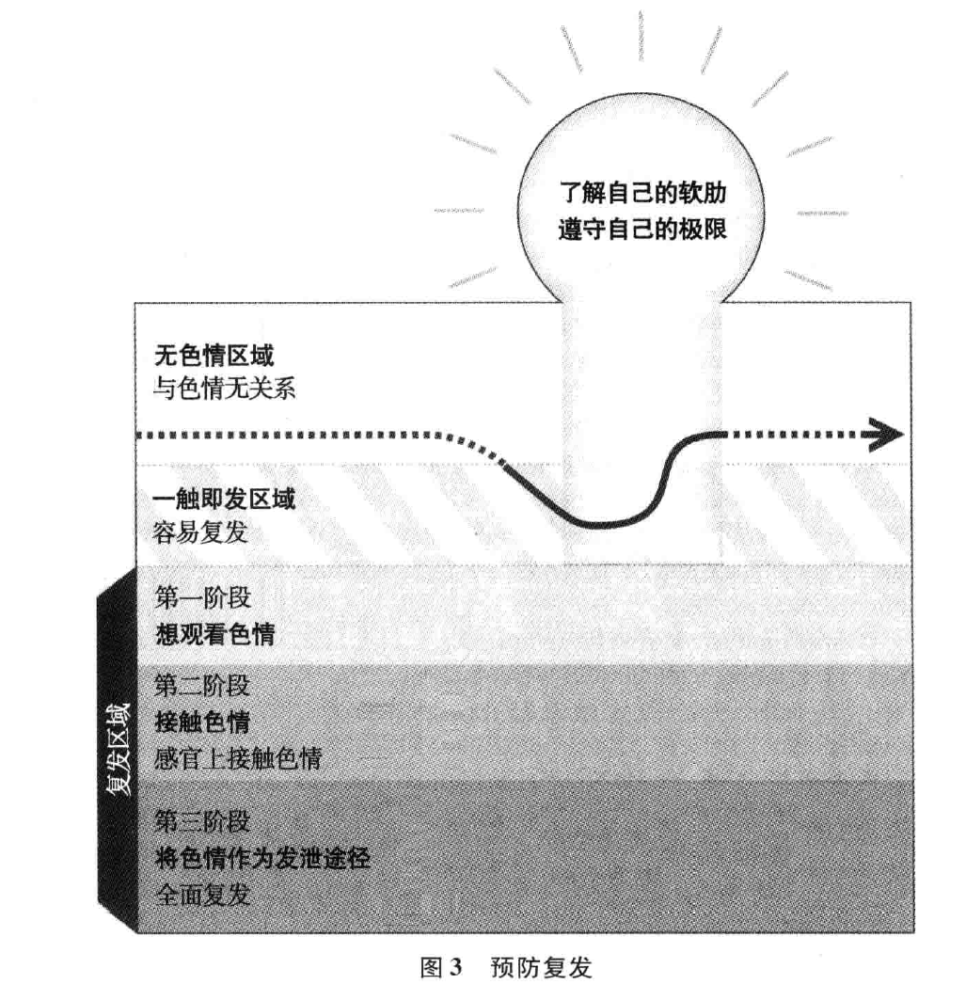

# 第九章  应对以及预防色情瘾复发

>   旧习惯和我不过一天一时之隔。

>   ——艾德

德鲁,35岁，身为人父，在他自以为色情瘾痊愈后许久，色情瘾
的恶化突如其来，他又开始重新看色情，这让他很是懊悔，同
时也惊异不已。“我康复之后的3年内，都没有想要看色情他说，
“有天晚上，妻子有事出了镇，我就开始在网络上看色情。之后我几乎
每天晚上都要对着色情自慰。现在看色情比以前方便多了，现在的网
速快得很，而且我的电脑也没有屏蔽色情的软件，我完全陷进去了。”
科里康复后第一年内，色情瘾渐渐复发，这让他心烦意乱。“我上
网的时候不知不觉就去看那些内衣广告他说，“看了几个之后，我
想:没事的，不过是内衣而已我自己骗自己，不肯承认被挑起了性
欲。接着我就去浏览泳装网站，心里想，没事的，不过是泳装而已。性
欲克制不住的时候，我就想，对着画面打手枪应该没什么问题，这根本
算不上是色情嘛。这样五六天一过，我就慢慢回到了看色情的老路 上。”

德鲁和科里在色情瘾复发时都非常震惊，对自己失望不已。即使
他们和其他色情瘾者交流时会了解到复发是正常现象,但他们还是不

希望这事发生在自己身上。他们会觉得羞愧，也担心这个复发的含
义。这只是一时疏忽吗？自己是不是又回到看色情的老路上了？幸
运的是，他们都有一个强大的亲友团随时听命，帮助他们顺利地在康
复道路上前行。他们听取了咨询师和色情瘾康复小组其他成员的意
见和建议，来评估复发如何发生、为何发生，并采取对策，加强康复措 施。

本章将会详细讨论复发的症状：它的定义、发生的原因以及应对
的办法。笔者希望提供相关信息和工具，让读者武装自己，以免重新
陷人色情陷阱。笔者将会帮助读者判断刺激色情欲望的因素，寻求减
少复发风险的途径，让人及时远离色情，在第一时间避免重陷深渊的 策略。

笔者将会为读者提供具有建设性意义的对策，以防色情瘾复发。
事实上，戒除色情瘾并不是直线进步的过程;这个过程常常会包含一
系列的进步和挫折。牢记这一点就可以帮助你带着自怜和宽容的心
态来审视复发的事实，这有利于实现康复目标。如果你善待自己，充
分发挥创造力，耶你就能找到合理的方式来戒除色情瘾。你只要掌控
了主动权，在复发时就能及时应对，重回正轨。

要成功戒除色情瘾，你就必须了解如何应对复发，并最终学会如
何克服复发。只要端正了态度，选对了方法，你就有能力将潜在的复
发，转化为加强自身正直品行的正能量，帮助自己远离色情，追求美好 生活。

## 什么是色情癮复发？

笔者将色情瘾复发定义为:恢复之前观看色情的行为。个人在认
识到由色情引发的问题后，作出戒瘾承诺，但之后又重新观看色情，就 称为色情瘾复发。

复发的表现形式多样，小到偶尔的疏忽，如拿起色情杂志翻看了
几分钟，大到彻底的倒退，如为了释放性欲，重新定期寻找和观看色
情。对大部分人来说，复发的时间越短，频率越低，涉及性的程度越
低，复发的威胁就越小。如果个人能迅速应对，就能将小小的疏忽转
化成警示灯，提高对自我的关注度，进一步弥补生活方式中的薄弱环节。

如果复发时间持续了几周或者几个月，色情又能够激发个人性
欲、促进高潮，个人基本上恢复了以往定期观看色情的行为，则是比较
棘手的。个人在远离色情一段时间后，重新恢复了对色情的情感依赖
和性依赖，这实际上会巩固色情瘾，因为复发会激发个人对色情的欲
望，使其行为更为恶劣，戒瘾过程更耗时、更具杀伤力。正如布莱德所
说:“我坚持不看色情才几个月，就又重新开始看了，好像潜意识里面
要把错过的那些都补回来。”

##   为什么会复发？

如果个人习惯于用色情来对抗情感压力，追求性快感，那么不论
你想要戒瘾的决心有多坚定，都无法抗拒想要继续看色情的欲望。色
情瘾是一个周期性的症状，它并不会因为个人不看色情就自动消失。
第四章中介绍过，长期观看色情和酗酒、吸毒一样，会改变大脑分泌的
化学物质，想让一切恢复正常需要时间。

色情瘾康复者常常会极度渴望色情，即使在色情瘾痊愈之后，这
种欲望还会继续困扰他们数个月甚至几年。能引发色情联想的情感、
想法和情景，都会引起他们的兴奋回忆，激起他们潜意识中对色情的
渴望。布莱德说:“酒鬼都是‘一辈子的’，只要世上一天有酒，他们就
不会停。烟鬼也会很爽快地承认他们是‘一辈子的烟鬼’。好吧，对我
们这些有色情瘾的人来说也是这样。一旦你和色情有了性关系，那你
就永远跳不出它的魔掌了。”

色情瘾容易反复，源于现在的社会环境充斥着大量刺激的性信息
和影像。惹火的影像到处都是，要长期避开所有的色情信息并不现
实，杂志里面的啤酒广告，电视屏幕上穿着比基尼的表演者，在非色情

网站弹出来的色情链接。不过话说回来，就算那一大堆刺激性的影像
不存在于现实世界，看过的色情影像还是会残留在脑海中。埃里克斯
色情瘾痊愈已有十余年了，他告诉笔者，“现在想要远离色情还是很困
难。我的脑子里面还满是那些念头。任何时候，我都能回想起过去喜
欢的色情故事和图像，那些东西已经印在脑子里了。”

毒品和酒精瘾康复者告诉笔者，色情让人难以抗拒，数量繁多，又
能引发强烈的性快感，这让他们觉得和烟瘾毒瘾相比，色情瘾更容易
复发。拉斐尔，一名36岁的色情和酒精成瘾者告诉笔者，他对色情的
欲望胜过对酒精的渴望。他说，观看色情不会像喝酒那样带来直接伤
害。“喝酒的时候，”他说，“喝多了会狂吐，不能开车，宿醉，但是色情
不一样。我没有哪次对着色情自慰不嗨的。要强迫自己停止看色情， 需要很强大的理智。”

柯克曾经是大麻和色情成瘾者，他说色情瘾的反复比戒除大麻还
要痛苦。“要戒除大麻，我只要不去买，不和毒友鬼混就可以了，”他
说我不去聚会了，也不碰朋友家里的大麻烟卷，我现在都不跟那些
毒友来往了。可是要避开色情就没那么容易了，性感图片到处都是，
任何时候只要我想，就能看到色情。要远离色情，还要付出更多。”
很多观看者低估了色情的影响力，觉得自己能够避免、抗拒色情
带来的冲动和欲望，这种自负心理并不利于克服复发。牧师吉姆•托
马斯会提醒每位加入男性色情康复团体的新成员：“这个房间里的每
位成员或多或少都有过复发。不要掉以轻心，认为这种事不会发生在
自己身上，在你以为自己行的时候，它可能就潜伏在你的身边。”

即使个人下定决心要戒除色情瘾，也得到了他人的关怀和支持，
可是复发还可能会出现。一些色情瘾痊愈者认为，康复早期是复发的
高风险时期，因为他们对这个决定还有所迟疑，或者疏忽大意,也还未
戒掉通过色情来获取性快感的习惯，所有这些因素让他们难以彻底远 离色情。

另外一些色情瘾痊愈者告诉笔者，在康复后期，当他们信心十足，
认为自己已经掌控了进程时，复发的风险很大。那时他们已经忘记自

己曾经怎样依赖于色情，也忘记了色情会带来的问题，甚至忘记了即
使稍稍接触色情也会非常危险。成功远离色情的那段经历也会让他
们降低戒备心。“我以为自己可以的，”科里说，“我只是想要测试，自
己还可以接受什么程度的色情。”科里也发现这种“测试”会增加自己
暴露于色情的风险，削弱抵抗力，甚至在自己察觉之前就导致了复发。

##   复发如何发生？

色情瘾的反复同不小心踩到路上的水坑不一样。康复中的色情
瘾者不会毫无缘由地就重新陷入色情陷阱之中。跟生活中很多事情一
样，复发不是一激而就的，而是阶段性发展的。它在特定时间段内发生,
阶段性地发生。起初个人和色情无关时，笔者称这个状态为“无色情区
域”;进而演变到个人对色情没有抵抗力的状态，即“一触即发区域％
在这个区域内，就意味着个人会阶段性地重拾色情瘾。图1“复发过程”
显示，色情瘾复发在个人重新接触色情之前,就已经显出苗头了。

治疗色情瘾的最终目标是停留在无色情区域，即在精神和身体等
各方面完全不接触色情，不受色情影响。如果读者培养出本书第十二
章中所描绘的基本行为准则，就可以保证自己停留在无色情区域内。

当个人身处无色情区域时，环境中的外在影响或者是自身的情感
和肉体感受，都可能会刺激个人进人一触即发区域**D** —旦进人这个区
域，即使个人没有采取任何具体措施，心理上就会产生想要看色情的
念头。外在的导火线，包括意外地接触到性意味的影像和信息，遇到
挑逗性欲的人，接触色情传递系统，如电视和网络。内在导火线包括
精神压力，觉得沮丧、孤独，或是感到愤怒、压抑，精神焦虑、精疲力竭，
性方面受到压力或者是受到酒精、毒品的影响。查理说：“我在看
**MTV**，看报纸的时候，就知道自己已经在一触即发区域，就快要进人复
发区域了，我老安慰自己说，总没有坏到看色情。”

导火线因人而异。比如说，看带性爱镜头的限制级电影会触发人
看色情的念头，但对另外一些人来说完全无效。

很多色情瘾康复者已经进人触发阶段，却还蒙在鼓里，这种情况
很普遍。很多时候，我们甚至都没有注意到存在的问题，可能当下并
没有想看色情的念头，但是几天或是几个月之后，个人就失去了对色
情的戒备，那么色情瘾随时都有可能复发。“我不知道那是复发给我
挖的陷阱，”布莱德说我先是感受特别，紧接着有些事会激发我，我
还蒙在鼓里的时候，其实心里早就想看色情了。到了这个时候，我要
不就是咬紧牙关，好好过小日子，尽最大的努力不去看，要不我就马上
缴械投降了。导火线可以仅仅是开车时看到啤酒广告牌上面的大胸 脯女人。”

即使身处一触即发区域，个人还是有机会避免色情瘾复发。清楚
自己的软肋，当刺激性事物出现时，采取措施去平息，以免自己陷入复
发阶段。而且，身处一触即发阶段时，要远离色情回到无色情区域还来得及。

处在复发区域的第一阶段时，个人会想看色情。享受色情的回忆
浮上心头，个人就会怀念看色情时的舒坦，开始计划何时再看色情。
“我总是会想到性，开始自娱自乐，”尼克分析了过去的复发情景，总结
说要是有了这种念头，就算只有零点零一秒，我就死定了。色情的
幻想很刺激，而且那时我也没办法让自己不去想那些。在复发阶段的
时候，我就已经把色情的害处全都抛到脑后了。我原本以为自己可以
轻松应付,但其实那是很危险的。这就好像两根电线碰到了一起，我
都没来得及把它们拉扯开来，它们就已经碰撞出火花来了。一旦火花
点燃了，我就被欲望牵着鼻子走，想去搜索色情了。”

如果没有及时遏制欲望，且欲望一再被激起的话，个人就会进人
复发区域的第二阶段，开始看色情是迟早的事。不管是随便翻阅色情
杂志，租借色情**DVD**，还是登录色情网站，就是个人重新看色情、进一
步陷人复发区域的第三阶段，将色情当作性发泄的方式。如果个人身
处第三阶段，将色情当作激发性欲，促进自慰和高潮的方法，继续频繁
看色情的行为非常危险，因为色情带来的快感会刺激个人的欲望。如
果复发的第三阶段反复循环，那么个人戒瘾的长期努力就可能全部化 为泡影。

个人在复发区域陷得越深，就越难回头。这就好像流沙的吞噬力
量，让人坠落到无底深渊，想要看色情的欲望会无限扩大。和色情保
持性关系的念头，先是让人觉得好玩，然后是期盼和向往，最后就是实 施了。

##   如何遏制复发

不幸的是，当个人陷入复发区域时，没有什么外界的警告和指
示——没有霓虹灯也没有警示灯——来提醒你。这样一来，个人可能
只有到了想要看色情或者开始看色情的时候，才会意识到自己处在复
发阶段了。不论个人在复发区域的哪个阶段，最好的办法就是，采取
正确的措施，回头是岸，尽快回到无色情区域。

通过实行以下五步预防法，读者可以有效地遏制复发：

1.  停止自己正在做的事，承认自己确实已经进入了危险区

2.  远离色情念头和色情

3.  安抚自己的精神和情感

4.  求助于外界

5.  重申自己的康复承诺

图2显示，读者可以在任何时刻，通过实施以下5个步骤，来防止
自己在复发区域越陷越深，并重回无色情区域。

接下来，笔者将会详细介绍五步防复发法。

1.**停止自己正在做的事，承认自己确实已经进入了危险区**。如果意识到自己正在做的事会让你想要看色情，那就必须马上停止。如果
你掉以轻心，忽视这些危险信号的话，就是在给自己挖陷阱，让自己在
复发区域越陷越深。另一方面来说，正视自己身处危险境地，摆脱色
情的想法和行为，可以打破自我麻醉的状态，遏制复发。“停止”就是
给自己一个机会，承认自己做的事很危险的。“如果我意识到自己在
看的内容让我想起了色情,”科里称，“我就会马上停止，告诉自己，这
就是色情，我不能再看了！对着自己大声地说出这个事实，我就会恢
复清醒，这让我没法跟自己撒谎。自欺欺人这种事，我以前看色情的 时候经常做。”

停止行为并承认事实的办法非常有效，这是抵抗色情瘾反复的必
备良药。一旦发现自己有想看色情的想法**，打住！**就算你是在对着色
情自慰的半路上，也要马上打住！打破过去观看色情的模式，重新控
制自身的思维和行动，作出正确的决定。

2.**远离色情念头和色情**。一旦你意识到自己身处复发区域，马上
    采取措施，尽可能远离色情。如果你想看色情，马上转移注意力。

如果你在用电脑，马上关机，转身离开。如果你在看电视,马上换
台，或者关掉电视，或者站起身来，离开房间。出去散步，给朋友打电
话，听听音乐，享受大自然的空气……做一件转移注意力的事（请参见
以下“转移注意力”方法）。

>转移注意力

>一个简单的感官意识测试可以帮助你停止现有的念头，转移注意力，转而去想身边的事物。首先说出这个短语:“现在我发现 ”，

>   然后把这个句子补充完整，把所见的事物补充进来。比如说，“现在
>   我发现大阳从窗户外面照射进来”。通过观察身边的不同事物，连
>   续重复、补充这个短语“现在我发现……”五次。接下来，根据自己
>   所听的声音造五个句子；然后用五个句子，说出你可以接触的事物或是内心的不同情感这个测试可以帮助你将注意力转移到现实
环境中，远离色情的虚幻世界。

不管多么欲火焚身，你还是有机会立刻改变当下的想法，拒绝正
在观看的事物，停止正在做的事情。玛丽就是在复发的半路上改了主
意。“我花了整整一天的时间开车在镇上转悠，想买色情杂志带回家，
从头看到尾。我路过很多家熟悉的杂志店，最后停在了一家门口，走
进去买杂志。我走到柜台前准备结账，就在那一瞬间，忽然醒悟到我
真的太二了，我就是被困在老习惯里面了。我把杂志放在柜台上，转 身离开了那家店。”

3.**安抚自己的精神和情感**。转移注意力非常必要，但同时你还要
    意识到自己已经被想法或行为刺激到了。心中一直想着看色情，这会
    引发特定的精神反应，如心跳加速、血压升高、生殖器充血、瞳孔放大，
    这些都会刺激复发。此外，幻想观看色情也会促使大脑分泌多巴胺和
    其他快感化学物质，这也会激起看色情的欲望。只要你停止想象观看
    色情,停止接触色情，这些精神和大脑化学物质的刺激作用就会渐渐
    消失。在此期间，你可能会因为没有得到色情带来的快感，感觉到身
    体上的不适。这就是为什么在性欲被激起时，学会安抚自己的重要 性。

即使你想要看色情或者已经在观看色情，要安抚自己的方法还有
很多。比如说,放松地坐下或者躺下，平稳呼吸,手放在胸口处，稳定
心跳频率，让自己镇静下来；堵住自己的右鼻孔，用左鼻孔进行深呼
吸，持续大约5分钟，这会让人放松;另一种有效的办法就是按摩双耳
的外轮廓，这样会带来轻松感，让人镇定;按摩自己的双足也可以转移
注意力，释放性兴奋。以非性的发泄方式让自己放松，这可以安抚被
刺激的大脑和身体。有些人发现，安静的祷告或是冥想有镇定作用，
让人放松，另一些人则发现激烈运动，比如慢跑、举重、骑车，可以燃烧 多余的精力。

4.**向外界求助。**有效抑制复发的方式之一就是向他人求助。给了解你情况的咨询师，靠谱的朋友,教堂带头人或是伴侣打电话，这会
把你从色情的世界中解救出来。牧师吉姆•托马斯解释道：“当你意
识到自己处在复发期，这是你打电话求助的黄金时间，向他人求助，跟
人接触，打断复发的过程。马上就和别人沟通，不要一个人在里面越 陷越深。”

麦切就是通过向牧师求助，从而成功将自己从复发的第二阶段解
救出来。“有天我在上网，不自觉地就开始浏览以前经常看的色情网
站，”他说，“我知道如果当时不立刻解决这个问题，我就会把这件事深
埋在心里,神不知鬼不觉，表现得好像没事人一样。当下我就马上打
电话给牧师，说：‘我现在尽快去找你，我想要你为我祈祷。我要忏悔，
我要自责。’牧师帮助我认识到，除了这个差错，我还是有进步的。在
过去，我根本不会这样做，但现在我很在意这件事。”

在复发的过程中或者是事后向外界求助，有一定的挑战性。布莱
德必须要努力克制自己的老习惯:“色情瘾复发的时候，我条件反射地
就是想要‘冬眠’——远离所有人，享受私密空间，”他说，“我真不敢
相信戒瘾竟然会失败。康复小组里的哥们儿都那么信任我，我也跟他
们保证过，但我还是失败了。我当时在想，我要怎么跟他们交代？”布
莱德在小组里坦白了复发的事，他发现所有的成员都很有同情心，善
解人意，他们也很熟悉复发的情况，纷纷给布莱德很多防止复发恶化 的建议。

埃里克斯一发现色情瘾复发的迹象，就会向妻子求助。“我要是
看到什么刺激性欲的内容，就会跟她说，她喜欢我向她求助。她一直
在身边支持我,变成了我康复过程的一部分，这让我很安心。”当然，前
一章已经讨论过，依靠伴侣来获取支持是否可靠，还要视情况而定。

抵抗复发时求助的对象，最好是了解你的情况、能提供有效建议， 并不断鼓励你的人士。

5.**重申康复承诺**。如果你自控成功，转移了自己的注意力，让自
    己冷静下来，并积极寻求帮助，那最后一步就是要坚定地重申戒除色
    情瘾的承诺。这个步骤需要你回想当初戒除色情瘾的原因，并明确自

己想要到达的人生高度。如果你再次确立康复目标，重振旗鼓，重新
明确承诺,你就会发现自己又回到了通往无色情生活的大道之上。

要重申承诺，最有效的办法之一就是重温自己在第七章中的回答
来加强自信心。提醒自己色情会带来的问题，它是如何让你与他人产
生隔阂，如何让你看不起自己，如何置你于危险之中，又是如何限制了
你的性知识。明确自己的价值观和人生目标，重新认识自己，了解自
己的生命价值以及人生目标。

既然决定戒除色情瘾，就要有始有终，就算遇到复发，也要为自己
的行为负责，采取相应的措施，确保自己不会再犯。如果你需要建议
或指导才能回到康复的正轨上,请借鉴前一章介绍的六步基本步骤
法。评估哪个是你之前忽略的步骤，哪个细节执行得不够彻底。头脑
风暴如何执行这些步骤，自己的康复才会更加顺畅。

一些康复中的色情瘾者认为，培养新习惯的办法十分有效，当自
己在复发边缘时，新习惯可以及时遏制欲望。肯是一名40岁的已婚
男子，他不希望自己一看到性感女人就想去看色情。在咨询师的指导
下，他养成了一个新习惯来时刻提醒自己，就是马上触摸、观赏自己无
名指上的结婚戒指，这样做会让他想起自己对妻子的爱和付出，还有
他想要把色情清扫出生命的决心。培养这个习惯几个月后，肯就很少
会有想看色情的念头了。

这五个策略——停止、远离、安抚、求助和重申，为戒除色情瘾提
供指导，能有效遏制复发。接下来，笔者将会详细介绍，如何自信地运
用自我意识，培养更多的技巧，让自己安全地远离复发。

##  预防未来复发

不论色情瘾是否复发过，探索预防复发的策略都非常必要。如果
个人能及时察觉自己接近或是进入了一触即发区域，并预备了有效办
法，就可以在复发进一步恶化前，火速将自己安全抢救回到无色情区
域。（请参见图3,预防复发。）

此处提供两种预防复发的方式：了解自己的软肋，遵守自己的极
限。下文将会详细介绍这两种方式。

**了解自己的软肋。** 要了解点燃复发的导火线，最佳办法便是分析过
去复发的情形，从中吸取教训。这个过程并不轻松，因为回想过去的复
发经历会引发愧疚和懊悔的负面情绪。但是，如果你将此视为色情瘾
康复教育的一部分，就能将自责情绪转化成具有教育性的正面启发。

科里回忆了过去的复发情形后，和治疗师进行了沟通，他希望了
解复发是怎样发生，又为何会发生。遭受了色情带来的毁灭性重击:
破裂的婚姻、他犯下的性侵罪行、在监狱中服刑，他简直不敢相信自己  
还会重新陷进去:“要是不弄清楚到底是怎么回事，我肯定还会再犯。”
在治疗师的帮助下，科里制订了一个时间表，时间段包含复发的整个
过程，他需要分析在这个时间段内自己每一刻的感受、想法和行为。
他希望通过这种方式来确定自己为什么对复发毫无抵抗力，以帮助他
在将来更好地判断复发的迹象。

科里发现，自己感到孤独寂寞，或是性得不到满足时，脑海中浮现
的性爱画面就是复发前兆。“起初我会说服自己说，我只是在看泳装
广告,”他说，“然后我开始看内衣目录。我骗自己说,这没什么大不
了。打开色情网站的时候，我就马上兴奋起来了，既然已经在兴头上
了，就没有干不出来的事情了，科里现在明白了，就算从理论上来说，
泳衣和内衣广告不算是色情,但是它们跟色情一样会让他性冲动。他
甚至都不需要自慰或者达到高潮，光是搜索图片的行为，期待搜索的
念头,就会让他兴奋。答案很明显，不是他看的内容，而是他为什么看
的原因、怎么样看的方式，才是复发的诱因。

玛丽为了防止复发，也分析了最近几次复发的情况，她认为主因
是精神脆弱之时，她急切需要安慰情绪的事物。“压力大的时候，我就
会觉得自己在生活中只是个**loser**,然后大脑就好像条件反射一样，开
始回放之前看过的，用来放松情绪的色情。接着我就被激发了，一心
想着去买色情来看。我现在明白了，平时压力太大的时候要格外注
意，马上减压，这样心里会舒坦点。”

德鲁也回头审视了两次复发经历，总结了教训。“第一次复发的
时候，咨询师分析是因为我太孤单了，戒瘾的决心也不够坚定。她建
议我去参加男性康复团体,但是我当时根本没有听进去。短短几个月
之后，我就又去看色情了，到那时我才听取了她的建议,参加了一个团
体。在过去的4年里，我每周都会去参加团体活动，这给了我很大的
帮助。我再也没有复发过了。”

读者可以借鉴科里、玛丽和德鲁的实例，从复发经历中吸取经验
教训。分析自己某次复发的情形，制订相应的事件时间表。判断在复
发过程中不同时间点，自己的情绪、心里的想法以及自己的行为。是

什么诱惑你进入复发区域？怎样做才不会再次受到诱惑？

还有一种了解自己软肋的方式就是全面想象在怎样的情况下自
己会把持不住，进而复发。这种视觉化的想象可以帮助你确定一系列
的因素，确定什么会促使你想到色情、想要获取色情、为了性目的而观
看色情。不论你是否复发过，都可以从这个治疗策略中受益。

以下测试“我的色情瘾是不是要复发了”可以帮助读者认识到，引
发色情瘾的因素复杂多样，了解这一点可以帮助你掌控复发过程。这
个测试会引发你的思索，激发联想，因此,笔者建议读者在咨询师等人
在场的情况下，进行这个测试。

> 我的色情瘾是不是要复发了

>   这个测试将会指导你幻想一段色情瘾复发的经历，促使你周全
>   考虑可能引起复发的因素。

>   想象自己即将色情瘾复发，以设想为基础，回答以下问题。结
>   合亲身经历来完善答案。每一题请给出尽可能'多的答案。

>   你可能身处的地点是（家里、工作场所、车里、旅馆、学校等）？

>   怎样的色情传递体系随时待命（电脑、电视、色情杂志、手机等）？
>   可能发生的时间（早上、中午、下午、晚上或是深夜）？

>   你可能和谁在一起（单独、朋友、伴侣、陌生人、一群人等）？

>   你可能在进行怎样的活动（工作、学习、进食、槔抒V休息、放松
>   时、娱乐时、运动时、阅读时、人际交往时等）？

>   你可能会感到的身体状况（疲惫、饥饿、愤怒、性兴奋、疼痛、精
>   疲力竭、病态、寒冷、发烧、衣冠不整、身体状态不佳、健康等)?

>   如果还伴有其他上瘾症状或者问题行为，你可能还在干什么
>   (吸烟、喝酒、吸毒、赌博、购物、熬夜、过度进食、过度工作等)?

>   可能刪刚发生的事件(一件让人失望的事情、遭到拒绝、有一个
>   成就、得到了奖项、付款、争吵、失去了一个机会、离开了某人等）？
>   可能所处的情感状态（孤独、压抑、愤怒、焦虑、沮丧、伤心、开心、无聊、失望、有力量等）？

> 你可能未受满足的需求（需要陪伴、激动、新颖、竞争、友谊、认
同感、爱、确定、放松、安慰等）？

>可能会激发的情感伤痕（感觉被抛弃、被背叛、被拒绝、觉得自
己无能、魅力不足、丢人、无能为力、不妥等）？

>你不经意间接触到的性意味内容可能出现在（电视节目中的暴
露画面、电影中的性爱镜头、网络上弹跳出的窗口、广告、露天广告
牌、杂志封面、露骨的性描写文字等）？

>你可能是以何种方式“越界”，做出了会让人联想到色情的行为(四下无人时上网、看电视时不停换台找性画面、在杂志上寻找性感
的图片、看限制级电影、在旅店看付费色情电视节目、参加色情聊天
室活动、私底下进行其他秘密行为、空闲时独自一人等）？

>如果色情瘾已经复发，可能是因为你之前没有采取的措施是
(停止行为并且承认自己在复发的危险区域、转移自己对色情念头
和色情画面的注意力、让自己在精神和情感上冷静下来、迅速求助
于外援、重新明确自己的康复承诺等）？

>读者在这个测试中确认的事物会促使复发。分析自己的答案，
思考你如何才能加强自己对色情的抵抗力，你需要更好地照顾自
己吗？需要学习如何安抚自己的感情吗？你需要改善和他人的关 系吗？

>多种导火线同时被激发，各种因素相互促进、相互加强的情况很是常见,，比如说，独自\^人、筋疲力尽、无聊、深夜在电脑前，这些
因素相互结合就会产生高危状态，、请在以下横线上写出相互联系
的因素，未来你需要特别注意这些因素

>最后，根据你在这个测试中学到的内容，在以T横线上列出一
系列健康的选择，对色情的抵抗力减弱时，你可以利用这些选择来 抵抗诱惑0\^ .

杰西,25岁，已婚，他在治疗色情瘾的过程中，并未经历过复发。
他设想了复发的情景，想象下班后，自己回到家里的车库，妻子还没回
来，他独自一人在车上。他想象自己因为害怕饭碗不保，焦躁不安。
他想象自己在开车回家的路上进了一家便利店，本来是想要买冷饮，
但从自动苏打饮料机走到收银台的途中，他就不自觉地拿了一本色情
杂志\^由此，杰西判断，自己需要被满足的需求包括放松的身体、确定
的安全感、工作表现良好以及自己能够得到重视。

杰西结合这些启示，制订出了一个防止复发的方案。他每天下班
后就给妻子梅根打电话。这个方案还有个意想不到的附加好处，就是
梅根每天晚上都会对他更加温柔体贴。如果杰西下班后想要喝冷饮，
吃糖果，他只会去那些不出售色情杂志的商店。他决定减少每天的咖
啡因摄取量，减少紧张焦虑感。他还让梅根每天晚上帮他按摩脖子和
肩膀，让自己得到舒缓。杰西的这些改变，帮助他应对并控制了情绪
波动，扼杀了他想要看色情的机会。

静下心来想象自己色情瘾复发的情景有一定的难度。没有人想
承认自己重新陷人色情的可能性,更不会想详细地描绘复发的过程。
不过，做过测试的色情瘾康复者一致认为，这个测试具有预见性，能帮
助他们意识到，其实自己很容易被诱惑，同时，他们也了解到怎样的措 施可以避免复发。

**遵守自己的极限。** 另一个防止复发的重要技巧就是要清楚自己
的极限所在，避免置身于髙风险的境况，不然很容易失守。了解自己
的软肋，个人就会知道自己行为和选择的极限。“我正在学习怎样远
离悬崖，而不是去测试我到底能靠它多近柯克解释道，“有一些事
情，不管是不是跟性有关,我都不再做了，我知道那是陷阱，会让我色
情瘾复发。我要时时注意自己在哪里、在做什么，这样才能保证自己
的安全。我现在就像是一个微博，需要经常更新自己的状态。”

以下举出一些个人改变的实例，这些色情瘾者采用的康复措施，
遵守个人极限，能有效减少复发的风险。

•汤姆喜欢举重，也会阅读相关的报纸杂志。健身杂志里面经常会出现半裸女性的图片，他过去常对着那些图片自慰，现在他已经 不碰那种杂志了。

•贾斯汀不再喝啤酒了，他过去常在看色情的时候喝。

•劳拉现在只看PG-13(适于13岁以下儿童）级的电影，因为R(适合18岁以上的成年人）级电影常有各种性瘾导火线，包括性爱
镜头、黄色笑话、暴力，让她想去看色情。

了解自己的复发导火线，清楚并且遵守自己的极限，这些是预防
复发的重要条件。花点时间，考虑一下自己可以如何调整行为以减少
甚至消除对色情的渴望。尝试这些改变，坚持一段时间，你就可以见
证，这些改变是如何帮助你巩固了无色情的目标。

## 深人治疗阶段，预防色情瘾复发

对色情瘾深重的人来说，了解并规避导火线还远远不够。他们需
要更强有力的策略来预防复发。如第二章所述，大部分色情瘾者自幼
年或青春期以来，每每经受压力时便会去看色情发泄。即使现在已是
成人，他们对色情的依赖性还和年少时一样，无法减弱。

如果确实如此，那么色情瘾者需要解开童年时期的心结，找出自
己和色情的纠葛源头。尼克在戒除色情瘾的头几年间，一直在和复发
作斗争。“刚开始我看到的只是问题的表面现象，就是性吸引。我当
时以为只要解决这个问题就可以了。后来我才意识到，我对色情的兴
趣高温不退，肯定有其他更重要的因素，

在牧师和男性治疗团体的帮助下，尼克发掘出了行为背后的驱使
因素，那是一种想要得到肯定，希望被人接受的心理。“三年级的时
候，同伴们很没人性地嘲笑我。我觉得自己没用，低人一等，特别自
卑。只有在看色情小说和色情杂志的时候才能解脱。其实我就是用
色情来弥补失去的那个自我。不管什么时候，只要我觉得自己无能，
比不上别人的时候，我就会回来找色情，就这样。色情就成了一个根
深蒂固的习惯。现在，我能把色情和不幸的童年联系起来之后，对色情的兴趣也少了很多。”

和尼克一样，劳拉也是通过了解深层的精神问题来加强对色情的
抵抗力。“我在接受治疗的时候分析自己迷恋色情的原因，”她说,“我
最爱看那种描写高危性爱的文字，女主角非常柔弱、在身体上受到威
胁的那种。这其实就很明显了，我喜欢这种情景，就是因为我小时候
被兄弟性侵，经常觉得孤独无助。”

分析自己最痴迷的色情幻想类型，是一种分析内心深处思想的有效
办法。请在专业精神健康师的指导下回答以下问题，读者会有所启发：

•你最初喜欢的色情都是什么样的故事套路和情节？

•里面的主角是什么样的？在故事中主角如何和他人交流？为 什么会用这种交流方式？

•你最理想的色情幻想是否和过去的需求不满或者痛苦经历相关？

伊森告诉笔者:“我分析了自己从8岁以来的色情幻想，之后对色
情就没有那么热衷了。我之前喜欢的色情情节都是一名女性被男人
践踏、侮辱，甚至受到虐待。不管男人怎么对她，女性都会觉得这个男
人了不起，死守着不肯离开。我分析了那些幻想，觉得那不仅仅跟性
爱有关系，它们也表现了我年幼时因为妈妈常常不在而对妈妈的不
满，自己无能为力，没有安全感。”

伊森分析了色情幻想中的人际机制，就意识到这种想法有悖常
理，会阻碍他在现实中追求真挚的情感。“我从小幻想的那种女性在
现实中根本不存在，”他说,“就算真有女人会受虐到这种程度的话，我
也不会喜欢的。再抱着这种幻想就太傻了，我已经没兴趣了。到了我
这个年纪，我更喜欢现实一点，追求一段健康的关系。”

色情瘾复发会让人心情低落，觉得羞愧又自惭。不过你始终可以
扭转局势，充分利用过去的复发经历，更好地了解自己，发掘出色情成
瘾的潜在因素，激励自己走上无色情的人生道路。科里很明智地告诉
笔者:“你可以把复发看成是失败。但是我体会到，复发只是一个暂时
的后退。不管你对自己有多失望，这都是一个很好的教训。”
