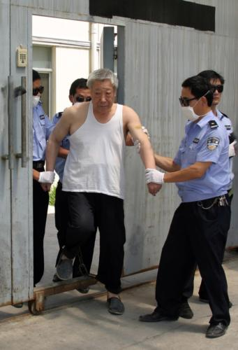

<html>

<head>
</head>

<body leftMargin="10" topMargin="10" rightMargin="10" bgcolor="#D0D0D0">

<table cellSpacing="7" cellPadding="7" width="100%" border="0" bgColor="#C8C8C8"
style="FONT-SIZE: 15px; line-height: 18px; font-family: Verdana, Arial">
<TBODY>
  <tr>
    <td width="100%" height="55" bgcolor="#C0C0C0"
    style="font-weight: bold; line-height: 55px; color: rgb(0,0,255); font-size: 15pt">
奸淫20余名女学生的前全国人大代表被执行死刑</td>
  </tr>
  <tr>
    <td bgcolor="#C0C0C0">
    
    
    </td>
  </tr>
  <tr>
    <td bgcolor="#C0C0C0" style="line-height: 21px;">河南镇平原政协副主席吴天喜因多项犯罪被执行死刑  新华网　2009年08月14日   　　  8月13日下午，曾奸淫20余名女学生、身负七项罪名的河南省镇平县政协原副主席吴天喜被南阳市中级人民法院依法注射执行了死刑。  大河网    　　新华网郑州8月14日电(记者程红根)河南省南阳市中级人民法院遵照最高人民法院签发的执行死刑命令，于13日依法对因犯强奸罪，组织、领导黑社会性质组织罪等7项罪名的前全国人大代表、镇平县贾宋食品系列集团股份有限公司法人代表、镇平县原政协副主席吴天喜执行了死刑。  　　法院经审理查明，吴天喜利用自己长期担任企业负责人和人大代表等职务形成的社会影响，纠集吴庆有、吴长卫等人，以暴力、威胁等手段，有组织地进行违法犯罪活动，逐渐在当地形成黑社会性质组织。   　　为满足自己的淫欲，2005年至2007年初，在吴天喜的利诱和指使下，刘某纠集张某等人先后多次窜至镇平县多所中学附近，采取诱骗、恐吓、威逼、殴打等手段，将20余名女学生挟持到吴天喜的办公室、居住的宾馆房间供吴天喜奸淫，其中有多名幼女，在社会上造成极为恶劣的影响和严重的危害后果。  　　1992年以来，为了聚敛钱财，扩张自己的势力，吴天喜利用职务形成的社会影响，将欲得到关照和庇护而投靠自己的一些人，培养成自己的亲信，控制基层组织，操纵市场，赚取非法利益，并在当地逐步确立自己的强权地位，有组织地进行敲诈勒索、寻衅滋事、非法转让、倒卖土地使用权，强迫交易、非法吸收公众存款等违法犯罪活动。  　　2007年12月19日，南阳市中级人民法院作出一审判决，以吴天喜犯强奸罪、组织领导黑社会性质组织罪、强迫交易罪、非法集资罪、寻衅滋事罪等7项罪名，数罪并罚判处其死刑，剥夺政治权利终身，并处罚金人民币50万元。   　　一审宣判后，吴天喜提出上诉。2008年7月23日，河南省高级人民法院依法开庭审理，裁定驳回上诉，维持原判。经报请最高人民法院复核，最高人民法院裁定核准吴天喜死刑。 --------------------------------------------------------------------------------  河南镇平政协原副主席强奸20余名少女被判死刑 2008年01月16日04:25  人民网 （来源：东方今报）  　　□记者 张定有  　　今报南阳讯           记者昨天从有关部门获悉，因犯强奸罪等6项罪名，镇平县政协原副主席吴天喜近日一审被南阳市中级人民法院判处死刑，并处罚金50万元。  　　今年61岁的吴天喜是镇平县政协原副主席，镇平县贾宋食品系列集团股份有限公司总经理，当地著名的农民企业家，有“镇平首富”之称。  　　据警方调查，2005年春，吴天喜开始指使一名叫刘培的年轻女子为他寻找处女，此后的两年间，吴天喜先后向20多名女初中学生伸出了黑手。2007年4月17日，吴天喜被警方刑事拘留。  　　法院查明，除强奸罪之外，吴天喜还犯有领导、参与黑社会性质组织罪，强迫交易罪，非法集资罪等5项罪名。数罪并罚，吴天喜近日被法院一审判处死刑，剥夺政治权利终身，并处罚金50万元。同案被告刘培等人，分别被判处有期徒刑20年或6个月不等。(来源：东方今报)  　　相关报道：  　　吴天喜身份  　　吴天喜，61岁，九届全国人大代表、河南省镇平县政协原副主席、镇平县贾宋食品系列集团股份有限公司创办人、总经理。一度有“镇平首富”之称。  　　1988年，吴天喜获得国务院第一次全国民族团结进步表彰大会模范个人称号。  　　1998年，他当选九届全国人大代表。  　　2002年，入选河南省第三届乡镇企业优秀厂长(经理、董事长)。  　　《镇平县志》介绍其贾宋镇食品系列(集团)有限公司时说：公司拥有资产10760万元，其中固定资产6400万元，流动资金4360万元，下属18个成员企业，员工1380人，主要有清真冷冻厂、制革厂、饲料厂等6个加工厂，黄牛育肥、水产养殖、种鸡种鸭等5个养殖场。另据介绍，他还开办过一家选钼厂。  　　今年4月份的镇平县“两会”后，吴不再任政协副主席。之后，被警方抓捕。  　　动机  　　吴天喜强奸女生的动机，当地较为流行的一个说法是，年逾花甲的吴天喜经济与身体逐渐透支与亏空，他相信通过采阴补阳之术，可以延年益寿，还完全可以继续官运亨通、飞黄腾达。经“有道之人”指点，他开始寻找处女，数目是100个。</td>
  </tr>
  <tr>
    <td bgcolor="#C0C0C0" style="line-height: 21px;"></td>
  </tr>
  <tr>
    <td bgcolor="#C0C0C0">收录时间：2009年11月10日，14点50分 
    编辑时间：2009年11月10日，22点4分</td>
  </tr>
</TBODY>
</table>
</body>
</html>

