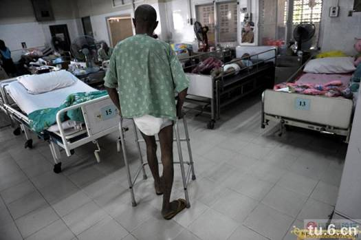
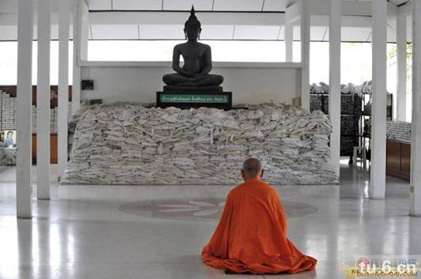
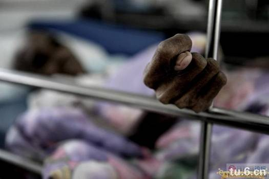
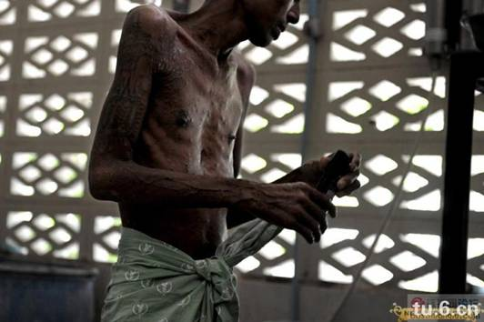
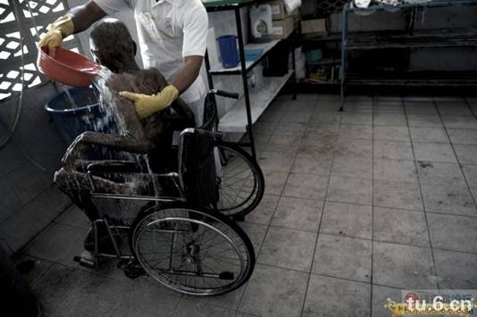

<html>

<head>
</head>

<body leftMargin="10" topMargin="10" rightMargin="10" bgcolor="#D0D0D0">

<table cellSpacing="7" cellPadding="7" width="100%" border="0" bgColor="#C8C8C8"
style="FONT-SIZE: 15px; line-height: 18px; font-family: Verdana, Arial">
<TBODY>
  <tr>
    <td width="100%" height="55" bgcolor="#C0C0C0"
    style="font-weight: bold; line-height: 55px; color: rgb(0,0,255); font-size: 15pt">
泰国最大的艾滋病收容中心——佛印寺（仅想起教育作用）</td>
  </tr>
  <tr>
    <td bgcolor="#C0C0C0">
    
    
    </td>
  </tr>
  <tr>
    <td bgcolor="#C0C0C0" style="line-height: 21px;">位于泰国拉布理省（Lopburi）的佛印寺（wat phra baht nam phu),是泰国最大的晚期艾滋病人收容中心，这里专门收容被家人遗弃或者无所依靠的艾滋病人，让他们能够有尊严的走完人生最后一段路。  佛像前堆放着一袋袋骨灰，白色的麻布袋上写着死者的名字，代表着他们曾经存在过。这座佛寺从1992年开始，先后收留一万多名晚期艾滋病患者，而整个泰国的HIV感染者保守估计超过100万。  寺庙的一角码着无人认领的骨灰盒，寺庙希望通过这种近乎残酷的死亡展示，警醒世人勿因贪欢而送命。  走近寺院深处病房，死亡气息立刻扑面而来。即使是换药清洗期间浓重的消毒水味，也掩盖不住那种肌体慢慢死去、慢慢腐烂的气味。  如果不是亲眼所见，很难想象一个人居然可以瘦到这种程度，从手臂到胸口，乃至大腿小腿身体每个地方都在溃烂。  在这里，几乎每天都有人死去。处于晚期的艾滋病人，大多活不过一周。  在泰国，色情行业泛滥是导致艾滋病毒疯狂扩散的元凶，一时的纵欲贪念，给整个社会带来数以亿计的经济损失。  希望给各位师兄能有些许的教育意义。足矣。                  </td>
  </tr>
  <tr>
    <td bgcolor="#C0C0C0" style="line-height: 21px;"></td>
  </tr>
  <tr>
    <td bgcolor="#C0C0C0">收录时间：2009年11月10日，14点50分 
    编辑时间：2009年11月10日，20点0分</td>
  </tr>
</TBODY>
</table>
</body>
</html>

