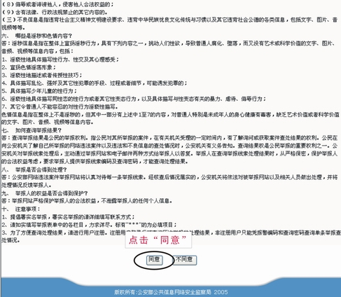
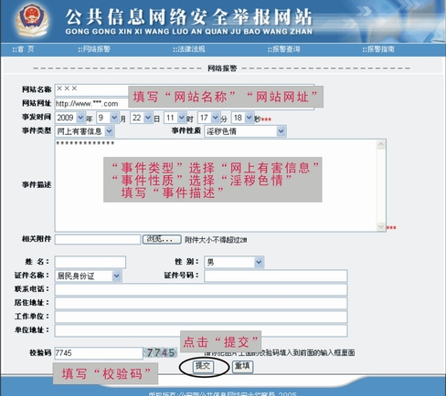
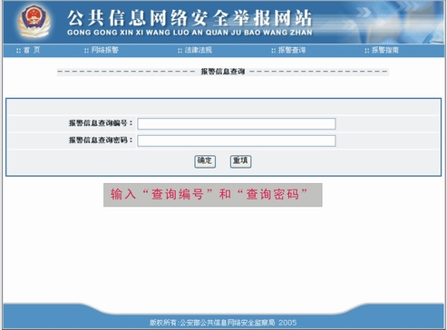

<html>

<head>
</head>

<body leftMargin="10" topMargin="10" rightMargin="10" bgcolor="#D0D0D0">

<table cellSpacing="7" cellPadding="7" width="100%" border="0" bgColor="#C8C8C8"
style="FONT-SIZE: 15px; line-height: 18px; font-family: Verdana, Arial">
<TBODY>
  <tr>
    <td width="100%" height="55" bgcolor="#C0C0C0"
    style="font-weight: bold; line-height: 55px; color: rgb(0,0,255); font-size: 15pt">
举报色情网站菜鸟级教程</td>
  </tr>
  <tr>
    <td bgcolor="#C0C0C0">
    
    
    </td>
  </tr>
  <tr>
    <td bgcolor="#C0C0C0" style="line-height: 21px;">报警步骤一：  打开“公安部公共信息网络安全监察网”  举报网站地址:http://www.cyberpolice.cn/     报警步骤二：点击“网络报警”。    报警步骤三：点击“同意”。    报警步骤四：填写“网站名称”、“网站网址”、“事件描述”、“校验码”等相关信息，最后点击“提交”。    报警步骤五：报警成功，复制保存“查询编号”和“查询密码”。    报警步骤六：回网站首页，点击“报警查询”。    报警步骤七：输入“查询编号”和“查询密码”。    报警步骤八：查看“处理状态”和“反馈信息”。    因为要调查、取证，处理的速度并不快，所以有时一两个月后举报的色情网站还能访问都有可能。不过请大家信任公安机关，在下去年举报了十多个色情网站，前段时间试着打开时，都已经不能访问了。天下兴亡，匹夫有责！朋友，行动起来！</td>
  </tr>
  <tr>
    <td bgcolor="#C0C0C0" style="line-height: 21px;"></td>
  </tr>
  <tr>
    <td bgcolor="#C0C0C0">收录时间：2009年11月10日，14点50分 
    编辑时间：2009年12月5日，10点54分</td>
  </tr>
</TBODY>
</table>
</body>
</html>

