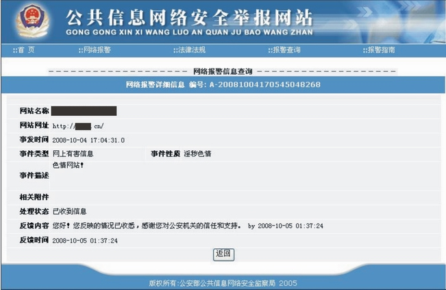
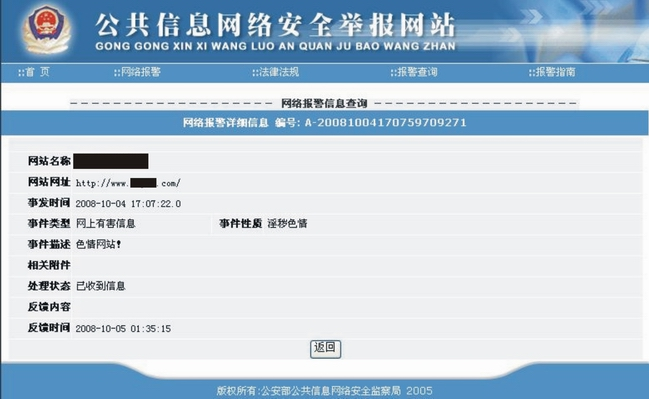
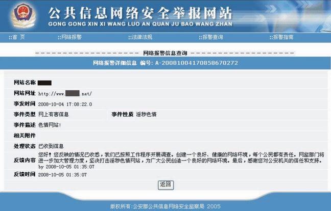

<html>

<head>
</head>

<body leftMargin="10" topMargin="10" rightMargin="10" bgcolor="#D0D0D0">

<table cellSpacing="7" cellPadding="7" width="100%" border="0" bgColor="#C8C8C8"
style="FONT-SIZE: 15px; line-height: 18px; font-family: Verdana, Arial">
<TBODY>
  <tr>
    <td width="100%" height="55" bgcolor="#C0C0C0"
    style="font-weight: bold; line-height: 55px; color: rgb(0,0,255); font-size: 15pt">
高兴！去年举报的黄色网站不能访问了！</td>
  </tr>
  <tr>
    <td bgcolor="#C0C0C0">
    
    
    </td>
  </tr>
  <tr>
    <td bgcolor="#C0C0C0" style="line-height: 21px;">公安部公共信息网络安全监察网 举报网站地址:http://www.cyberpolice.cn/infoCategoryListAction.do?act=init            </td>
  </tr>
  <tr>
    <td bgcolor="#C0C0C0" style="line-height: 21px;"></td>
  </tr>
  <tr>
    <td bgcolor="#C0C0C0">收录时间：2009年11月10日，14点50分 
    编辑时间：2009年11月10日，22点0分</td>
  </tr>
</TBODY>
</table>
</body>
</html>

