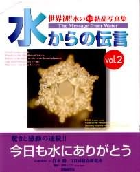
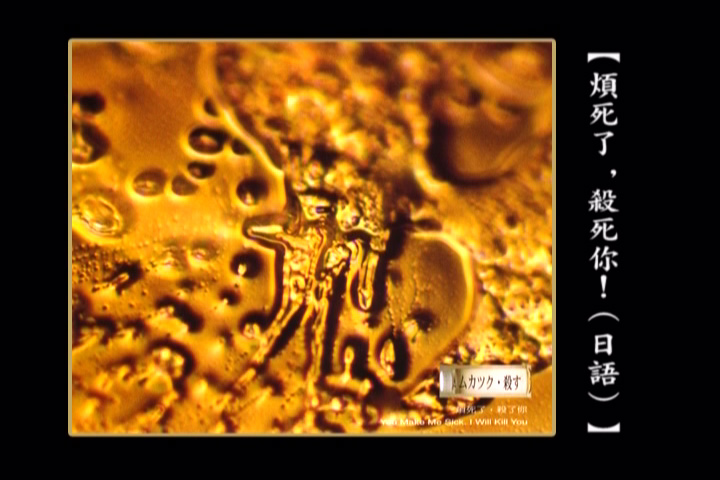
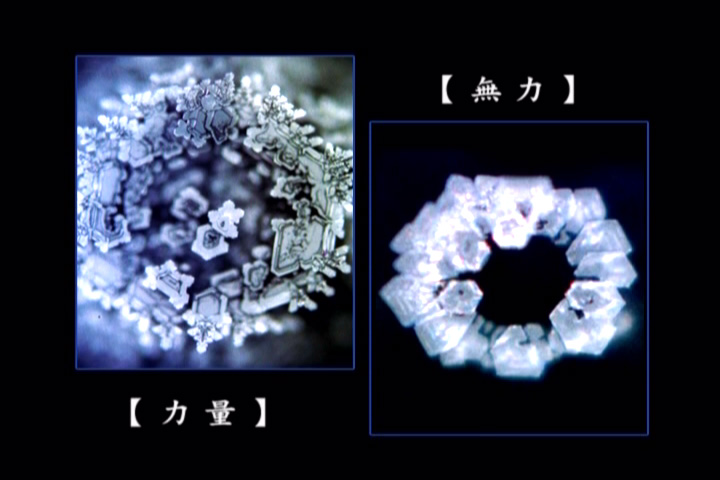
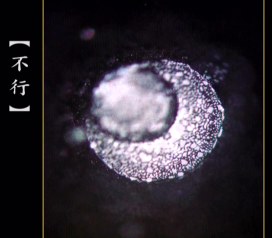
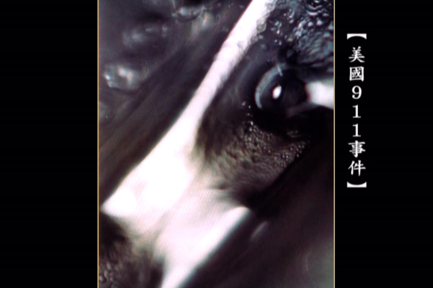
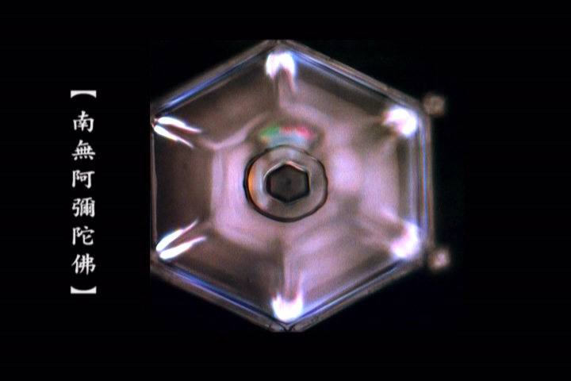

<html>

<head>
</head>

<body leftMargin="10" topMargin="10" rightMargin="10" bgcolor="#D0D0D0">

<table cellSpacing="7" cellPadding="7" width="100%" border="0" bgColor="#C8C8C8"
style="FONT-SIZE: 15px; line-height: 18px; font-family: Verdana, Arial">
<TBODY>
  <tr>
    <td width="100%" height="55" bgcolor="#C0C0C0"
    style="font-weight: bold; line-height: 55px; color: rgb(0,0,255); font-size: 15pt">
来自水的信息——日本江本胜博士水结晶试验图片</td>
  </tr>
  <tr>
    <td bgcolor="#C0C0C0">
    
    
    </td>
  </tr>
  <tr>
    <td bgcolor="#C0C0C0" style="line-height: 21px;">一本叫《水知道答案》的书（有Vol.1，Vol.2两本）：江本胜先生希望通过这本书，通过水结晶，大家能够认识到“爱与感谢”的力量，换句话来说，是心灵给予万物的影响。   从1994年起，日本医学博士江本胜开始拍摄水结晶的照片，他将从世界各地采来的水样放入冰箱，在冰即将融化成水的临界点，用高速摄影技术留下了一张张水结晶的奇异面孔。   如果仅仅是完美无缺、晶莹剔透的六角形，那也没什么特别，奇妙的是，事先看过"爱和感谢"字样的水形成了华美庄严的结晶，看到"浑蛋"之类伤人的字眼的水则混沌一片丑陋不堪，听到巴赫作品的水如同乐曲结晶成相互联结的奇妙结构，若是听到嘈杂愤怒的重金属音乐水结晶的效果则与骂它"浑蛋"类似……122幅水结晶照片，都在试图说明，天然水总能形成美丽的结晶，而人工处理过的自来水和放置在电视、电脑、手机旁边的水都无法形成结晶。更有甚者，水对人类创造的语言、文字（包括日文、英文、法文、德文、中文等等）、图像都有所感应，水对善意的信号都报之以独具特色的美丽结晶，对恶意的诅咒则惊恐沮丧。水竟然具有复制、记忆、感受、传达信息的能力。   1．首先将各种水分别放到有盖的玻璃器皿中（刚开始进行实验的前几年，每次要用１００个玻璃器皿），然后放进冷冻库冻上３个小时。这样在玻璃器皿中会形成直径大约为１厘米的冰块。将光线投射到一个个凸起的冰块上，用显微镜观察，就能看到结晶。    2．在-25℃的条件下，将放在50个实验用的浅盘中的水滴冷却，使之形成圆形的冰粒。然后将其拿到-5℃的房间中，用200倍的显微镜观察。   当然，在每一个玻璃器皿上不会出现相同的结晶，有的甚至无法形成结晶。统计这些结晶，并制成图表后，就能了解水的性质，诸如哪些水会出现类似的结晶，哪些水根本不会形成结晶，还有哪些水只能形成一些破碎的结晶，等等。    《实验说明》    现任IHM总和研究所所长，以及IHM国际波动之友会会长的江本胜先生，因为经营「美国低周波治疗器执照公司」，开始接触最新的「水」研究技术，引发他将「水」冰冻后的水结晶照相的研究构想。自1994年开始，江本先生展开了一连串对「水结晶」的科学探索之旅。  江本胜先生将MRA(Magnetic Resonance Analyzer，共鸣磁场分析器)运用在水结晶的研究调查中，得到了许多惊人的成果，并在日本造成轰动。他表示，这些研究结果显示：所有的物质特性也会影响水的特性，水的波动（频率）可以解释所有物质的特性。他的研究室也取名为「波动研究室」。  IHM综合研究所，以高速摄影技术来观察水结晶的形状。实验程序是：把实验水分别滴在一百个试皿中，在冷藏室冷冻2个小时，通过显微镜将有结晶的冰用200至500倍的倍率拍照它的顶端部位。  「水」能够分辨讯息中的正、邪、善、恶吗？「水」也能够接收到来自声音、文字、音乐、意念的良善或邪恶的讯息吗？  这是不是说明了「意念」是有物质能量的？善与恶的意念会影响着人体与大自然？  水分占人体重量的60%-70%，地球表面积有70%被水覆盖，这些水接收到我们人类给予他们的善念还是恶念的讯息呢？人的身体和地球生态会有什么样的变化呢？  人类如果希望世界更美好，也许并不是追求更多的物质金钱，而是多发出「良善」的讯息，不是吗？不需我们多说，只要看看「爱和感谢」的讯息呈现出的水结晶便知道了！                                </td>
  </tr>
  <tr>
    <td bgcolor="#C0C0C0" style="line-height: 21px;"></td>
  </tr>
  <tr>
    <td bgcolor="#C0C0C0">收录时间：2009年12月5日，10点0分 
    编辑时间：2009年12月5日，10点12分</td>
  </tr>
</TBODY>
</table>
</body>
</html>

