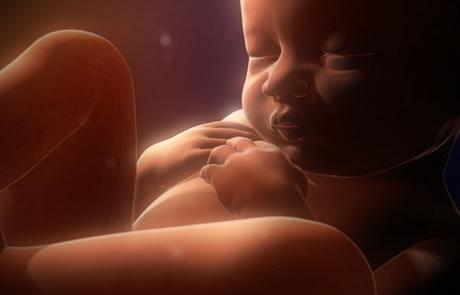

<html>

<head>
</head>

<body leftMargin="10" topMargin="10" rightMargin="10" bgcolor="#D0D0D0">

<table cellSpacing="7" cellPadding="7" width="100%" border="0" bgColor="#C8C8C8"
style="FONT-SIZE: 15px; line-height: 18px; font-family: Verdana, Arial">
<TBODY>
  <tr>
    <td width="100%" height="55" bgcolor="#C0C0C0"
    style="font-weight: bold; line-height: 55px; color: rgb(0,0,255); font-size: 15pt">
小宝宝在母亲肚子里的周日记</td>
  </tr>
  <tr>
    <td bgcolor="#C0C0C0">
    
    
    </td>
  </tr>
  <tr>
    <td bgcolor="#C0C0C0" style="line-height: 21px;">   　　妈妈，您好，我是您未出生的小宝宝，很感谢您在孕育我！  　　从您怀上我的第一天起，我就感觉到了您巨大的幸福与喜悦，这种感觉让我在您肚子里快乐的成长，开心的自在！我期望着我们母子相见的那一天。  　　妈妈，在您的肚子里，我感到很温暖很安全，您时时刻刻保护着我，我觉得我是天底下最幸福的宝宝了！  　　唯一让我担心的，就是怕您不高兴，要知道，妈妈，您一生气，我就会明显的感觉不舒服。母子连心嘛，我的喜怒哀乐和您是一样的，所以妈妈，我希望您天天都高高兴兴的，这样我也会很舒服吆。  　　妈妈，曾经有一段时间，是不是不想要我了？我那时好害怕呀，妈妈，你可知道，我是多么的伤心啊，如果你把我打掉，我就永远见不到您了，妈妈，我是很可爱很乖的呀！  　　妈妈，在您孤单的时候，我会和您一起玩的，我会用小脚丫子踢您的肚肚，在您肚肚里翻跟头，我可调皮啦。有时也会静静的听您讲故事呢，我就爱听三只小猪和大眼狼的故事。  　　妈妈，我在您的肚子里要待上十个月啊，嘻嘻，我容易吗妈妈？您很想知道我是怎样长大的吗，让我告诉您吧： 　　 　　头7天：受精卵看上去没什么变动；　　　　 　　第14天：稍长如薄酪；　　 　　第21天：似生酪；　　 　　第28天：凝似熟酪；　　 　　第35天：如生酥；　　 　　第42天：如嫩肉；　　 　　第49天：如腱肉；　　 　　第56天：坚如胚；　　 　　第63天：变了五个肉胞，生了两肘，两髀和颈项； 　　第70天：分化了手腕，脚和头部； 　　第77天：生了24个肉胞，从此演变出手指，眼耳鼻口； 　　第84天：这24个肉胞不断地成长； 　　第91天：出现腹部； 　　第98天：生了肺肝心脾肾； 　　第105天：生大肠； 　　第112天：生小肠； 　　第119天：生胃； 　　第126天：有了生脏和熟脏； 　　第133天：生髀，手掌，足趺和臂部已有筋连起来； 　　第140天：身体中各部分的骨骼已有点形成，这时头部有两块骨头； 　　第147天：开始有了两根口腔骨，七根颈骨，两根髀骨，两根肘骨，四根臂骨，十二根胸骨，十八根背骨，两根胶骨，四根膝盖骨，四十根脚骨，一百八十根细骨和肉相接合；其中有十八根细骨在两胁，两根在肩部；一共有三百根骨骼；这时的骨骼好像初生的瓠那么柔软； 　　第154天：骨骼开始慢慢转硬，好像未熟的瓠； 　　第161天：骨骼像胡桃那么坚固；前面那三百根骨骼相连的越来越牢，而且各部分的骨大致已成形； 　　第168天：长出七百条细筋联络身体； 　　第175天：生了七千条脉，但尚未成形； 　　第182天：七千条脉完成，宛如莲根的细孔； 　　第189天：有三百六十三条筋都成形了； 　　第196天：开始长肌肉； 　　第203天：肌肉逐渐长厚； 　　第210天：开始有了皮肤； 　　第217天：皮肤转厚； 　　第224天：皮肤越来越坚固； 　　第231天：耳朵，鼻子，手指和膝盖的关节发展完成； 　　第238天：皮肤生了九十九万个毛孔，但发孔仍未完成； 　　第245天：毛孔完全成形； 　　第252天：指甲出现； 　　第259天：耳朵，眼睛，鼻孔，嘴巴开始通了；毛发和皮肤的颜色也确定了； 　　第266天：胎儿的身体和骨骼都已成人形了；其中比较软的部分是从母亲方面遗传来的，比较硬的部份遗传自父亲； 　　 　　如果我是男孩，我的背向外而面向母亲，如果我是女婴则背向母亲而面向外，最后头朝下出生。  　　妈妈，我出生了，我终于见到您了！  　　妈妈，你知道我出生的第一件事是干什么吗？嘻嘻，我要吃您奶儿！</td>
  </tr>
  <tr>
    <td bgcolor="#C0C0C0" style="line-height: 21px;"></td>
  </tr>
  <tr>
    <td bgcolor="#C0C0C0">收录时间：2009年11月10日，14点50分 
    编辑时间：2009年11月10日，20点2分</td>
  </tr>
</TBODY>
</table>
</body>
</html>

